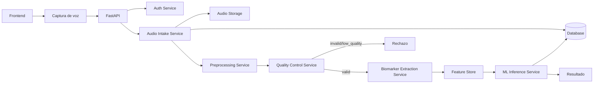
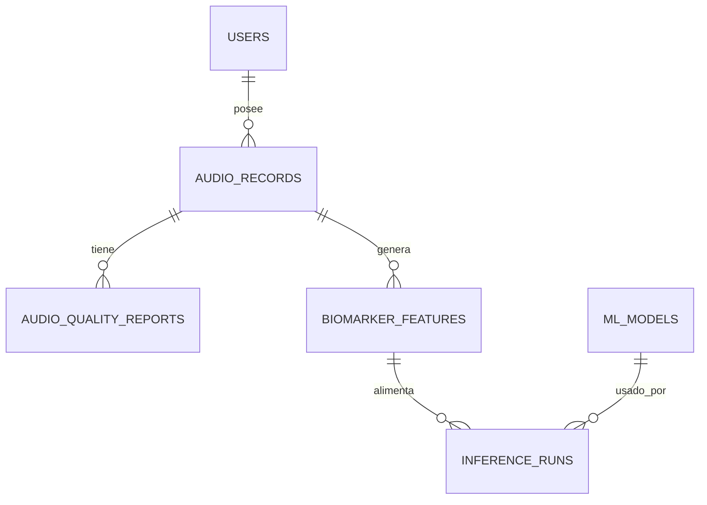
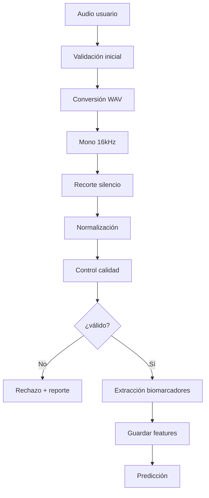

# Guía de Arquitectura MedDiag2 2.0

Documento complementario de trazabilidad histórica:
[Historia Técnica de Biomarcadores en MedDiag2](/home/aetaller2/Documentos/proyectos/MedDiag2/HISTORIA_TECNICA_BIOMARCADORES_MEDDIAG2.md)

## 1. Propósito

Definir la arquitectura objetivo de **MedDiag2** para soportar de extremo a extremo el ciclo de captura de voz, control de calidad, extracción de biomarcadores y predicción de Parkinson en contexto de tamizaje experimental.

Esta guía establece una referencia técnica común para diseño, desarrollo, validación y despliegue.

---

## 2. Objetivo del sistema

Construir una aplicación web capaz de:

- capturar una vocal sostenida del usuario,
- procesar el audio con un pipeline reproducible,
- extraer biomarcadores vocales confiables,
- estimar probabilidad de patrones asociados a Parkinson.

El sistema es de **apoyo y tamizaje experimental**; no reemplaza diagnóstico clínico.

---

## 3. Principio arquitectónico

> El sistema se diseña alrededor del ciclo biomarcador completo, no alrededor del archivo de audio.

---

## 4. Arquitectura general

---

## 5. Capas y responsabilidades

### 5.1 Frontend

- grabación/captura de voz,
- guía al usuario (duración, ambiente, intensidad),
- envío del audio vía `multipart/form-data`,
- visualización de estado y resultados.

### 5.2 API Layer (FastAPI)

- recepción de requests,
- validación inicial,
- orquestación del flujo,
- autenticación/autorización,
- trazabilidad de errores.

### 5.3 Audio Intake Service

- recepción de archivo,
- generación de UUID,
- almacenamiento del binario,
- registro de metadatos iniciales.

### 5.4 Preprocessing Service

- conversión a WAV PCM,
- mono,
- 16 kHz,
- recorte de silencios,
- normalización conservadora.

### 5.5 Quality Control Service

- validación de duración,
- clipping,
- ruido,
- RMS,
- estabilidad de señal,
- clasificación de calidad.

Estados QC esperados:

- `valid`,
- `invalid`,
- `low_quality`.

### 5.6 Biomarker Extraction Service

- extracción de features acústicos,
- Parselmouth como núcleo clínico,
- versionado de extractor y esquema de features.

Librerías recomendadas:

- `parselmouth` (núcleo biomarcador),
- `librosa` (soporte DSP/carga),
- `pydub` (compatibilidad de formatos),
- `soundfile` (normalización WAV),
- `numpy/scipy` (soporte matemático).

### 5.7 ML Inference Service

- selección de modelo,
- validación de features requeridas,
- inferencia y probabilidad,
- persistencia de corrida de inferencia.

### 5.8 Storage Layer

- almacenamiento de audio,
- base de datos relacional,
- persistencia separada de calidad/features/inferencia.

---

## 6. Modelo de datos objetivo

Entidades recomendadas:

### 6.1 `audio_records`

- `id`, `uuid`, `user_id`,
- `storage_path`, `duration_seconds`, `sample_rate`, `channels`,
- `status`, `created_at`.

### 6.2 `audio_quality_reports`

- `audio_record_id`,
- `quality_score`, `is_valid`,
- `noise_level`, `clipping`, `silence_ratio`,
- `rejection_reason`,
- `created_at`.

### 6.3 `biomarker_features`

- `audio_record_id`,
- `extractor_version`,
- `feature_schema_version`,
- `features_json`,
- `feature_status`,
- `created_at`.

### 6.4 `inference_runs`

- `audio_record_id`,
- `model_version`,
- `prediction`, `probability`,
- `created_at`.

### 6.5 `ml_models`

- `model_name`, `model_version`,
- `feature_schema_version`,
- `is_active`,
- `created_at`.

---

## 7. Estados del audio

Estados recomendados del flujo:

- `uploaded`,
- `preprocessing`,
- `quality_checked`,
- `rejected`,
- `features_extracted`,
- `partial_features`,
- `inference_completed`,
- `failed`,
- `archived`.

---

## 8. Endpoints recomendados

- `POST /audio/upload`
- `POST /audio/{id}/process`
- `GET /audio/{id}/quality`
- `GET /audio/{id}/features`
- `POST /audio/{id}/predict`
- `GET /diagnoses/{id}`

Endpoints de soporte:

- `GET /audio/me`
- `GET /audio/{id}`
- `POST /audio/batch-process` (opcional)
- `GET /diagnoses/history`

---

## 9. Pipeline mínimo viable

---

## 10. Reglas críticas

- No usar `0.0` como imputación silenciosa.
- No usar features sintéticas en inferencia productiva.
- No predecir con audio inválido o de baja calidad sin bandera explícita.
- No mezclar versiones de extractor, esquema de features y modelo.
- Toda predicción debe ser auditable.

---

## 11. Criterios de aceptación de arquitectura 2.0

Se considera cumplida cuando:

- existe compuerta de calidad previa a inferencia,
- existe persistencia separada de calidad/features/inferencia,
- existe versionado explícito de extractor y modelo,
- los estados del audio reflejan el flujo real,
- la API permite auditar calidad, features y resultado por separado.

---

## 12. Hoja de ruta sugerida

### Fase A: QC + estados

1. Implementar `audio_quality_reports`.
2. Implementar `Quality Control Service`.
3. Introducir estados `preprocessing`, `quality_checked`, `rejected`.

### Fase B: Feature Store

1. Implementar `biomarker_features`.
2. Guardar `extractor_version` y `feature_schema_version`.
3. Quitar dependencia principal de `notes` para features.

### Fase C: Inference desacoplada

1. Implementar `inference_runs`.
2. Exponer `POST /audio/{id}/predict`.
3. Exponer `GET /diagnoses/{id}`.

### Fase D: Cierre clínico-técnico

1. Unificar extracción principal con Parselmouth para biomarcadores clínicos clave.
2. Definir política formal para `partial_features`.
3. Consolidar pruebas de reproducibilidad intra-sujeto e inter-sesión.

---

## 13. Notas de gobernanza técnica

- Esta guía define el objetivo arquitectónico; no obliga a migración big-bang.
- Toda implementación debe priorizar trazabilidad y seguridad metodológica.
- Cambios de esquema deben acompañarse de migraciones y pruebas de regresión.
