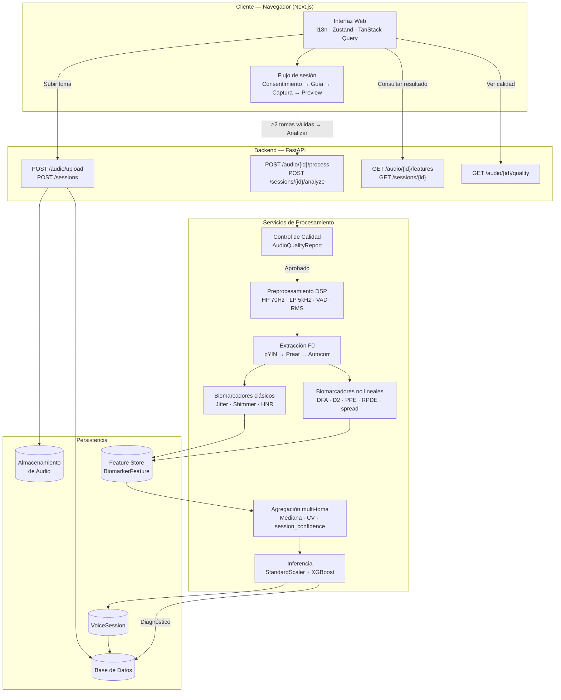
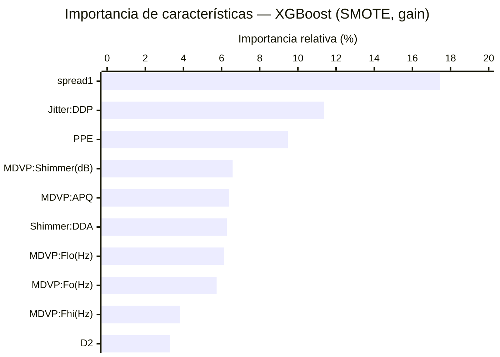
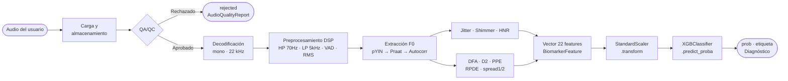

# MedDiag: Plataforma Experimental de Tamizaje de Parkinson Basada en Voz, Control de Calidad y Biomarcadores Acústicos Trazables

Adrián Espinosa — mauricio.espinosa@udea.edu.co
Diana C. Huertas — diana.huertas@udea.edu.co
David Rios — david.rios2@udea.edu.co

---

**Resumen**— MedDiag evoluciona desde un prototipo de apoyo diagnóstico basado en variables clínicas ingresadas manualmente hacia una plataforma académica de tamizaje experimental centrada en captura de voz, control de calidad de la muestra de audio, extracción de biomarcadores acústicos y trazabilidad de inferencia. El proyecto está compuesto por una aplicación web, un backend en FastAPI, almacenamiento de audios, procesamiento digital de señales y modelos de aprendizaje automático orientados al análisis preliminar de patrones vocales asociados a la enfermedad de Parkinson.

El enfoque técnico conserva biomarcadores interpretables porque el modelo histórico de Parkinson fue entrenado con variables acústicas estructuradas, no con audio crudo. Por ello, el reto central no consiste únicamente en recibir archivos de audio desde el usuario, sino en garantizar que las características extraídas sean comparables, reproducibles, auditables y metodológicamente defendibles.

MedDiag incorpora implementaciones determinísticas para biomarcadores no lineales como DFA, D2, PPE, RPDE, spread1 y spread2, que sustituyen aproximaciones no reproducibles de versiones anteriores. Estas implementaciones deben entenderse como una etapa experimental que requiere validación frente a herramientas de referencia y audios controlados. Adicionalmente, la versión actual incorpora un módulo de control de calidad de audio que calcula duración, energía RMS, saturación, relación señal-ruido, proporción de silencio, piso de ruido y ancho de banda antes de permitir la extracción de biomarcadores. Este control de calidad opera como una compuerta metodológica previa a la inferencia y reduce el riesgo de generar predicciones sobre señales inválidas.

En esta fase, MedDiag prioriza reproducibilidad, equivalencia de características, control de calidad, versionamiento y validación experimental antes que complejidad de infraestructura o modelos de caja negra. Parselmouth se consolida como núcleo primario de extracción de biomarcadores clásicos (F0, jitter, shimmer y HNR), mientras que Librosa cumple un rol de soporte en carga y procesamiento digital de señales. Una iteración posterior deberá incorporar datasets más pertinentes para validación externa, especialmente PC-GITA y NeuroVoz. MedDiag se define expresamente como una herramienta académica de apoyo y tamizaje experimental, no como un sistema de diagnóstico clínico.

**Palabras clave**— Parkinson, biomarcadores de voz, FastAPI, Parselmouth, Praat, Librosa, control de calidad de audio, aprendizaje automático, procesamiento digital de señales, tamizaje experimental.

---

## I. Introducción

La enfermedad de Parkinson es un trastorno neurodegenerativo progresivo que afecta el sistema nervioso y produce, entre otras manifestaciones, alteraciones vocales como hipofonía, inestabilidad de la fonación, variación de frecuencia fundamental, perturbaciones de amplitud y cambios en la relación armónico-ruido. Debido a ello, diversos estudios han explorado el uso de medidas acústicas como F0, jitter, shimmer, HNR, NHR, RPDE, DFA, D2 y PPE para construir modelos de clasificación, seguimiento o telemonitoreo de síntomas asociados al Parkinson [1], [2].

Este enfoque es especialmente adecuado para MedDiag porque el modelo histórico de Parkinson fue entrenado sobre variables biomédicas de voz estructuradas y no sobre audio crudo. Por esta razón, la evolución del proyecto no debe entenderse como una simple mejora de interfaz para recibir archivos de audio, sino como una reorganización metodológica alrededor del ciclo completo del biomarcador: captura, preprocesamiento, control de calidad, extracción, persistencia versionada, inferencia y auditoría.

La principal dificultad metodológica no radicó únicamente en construir un endpoint capaz de recibir audio, sino en cerrar la brecha entre el dato usado para entrenar el modelo y el dato generado en producción. En el modelo inicial, las variables acústicas ya estaban previamente calculadas; en la versión actual, esas variables deben obtenerse desde grabaciones reales, con diferencias de micrófono, ruido, duración, intensidad y estabilidad fonatoria. Por tanto, el valor investigativo del proyecto no depende solo de producir una probabilidad de riesgo, sino de demostrar que el pipeline de captura, control de calidad, extracción y versionamiento puede generar biomarcadores comparables, auditables y reproducibles.

Adoptar una ruta basada en biomarcadores interpretables permite mantener trazabilidad sobre las variables que alimentan el modelo, facilita la comparación con datasets clásicos y evita depender prematuramente de enfoques de aprendizaje profundo que requieren grandes volúmenes de audio etiquetado, control de sesgos y validación clínica robusta. En esta etapa, el proyecto prioriza la coherencia entre datos de entrenamiento, extracción en producción y explicación técnica del resultado.

---

## II. Planteamiento del Problema

La enfermedad de Parkinson carece, en la práctica clínica general, de herramientas de tamizaje rápido, accesibles y no invasivas que puedan aplicarse fuera del entorno hospitalario. El análisis de voz representa una alternativa prometedora porque puede realizarse de forma remota a partir de una grabación de audio simple, sin requerir equipamiento especializado.

La versión inicial de MedDiag funcionaba como una aplicación cliente-servidor que recibía un vector de biomarcadores acústicos ya calculados: frecuencia fundamental, jitter, shimmer, HNR y parámetros no lineales, entre otros. Esa arquitectura era suficiente para probar la integración de software, pero dejaba abierto el problema crítico de cómo obtener esos biomarcadores desde audio real capturado en condiciones variables.

Al plantear la evolución hacia análisis de voz real, se identificaron tres riesgos principales:

1. **Ruptura entre entrenamiento e inferencia**: el modelo fue entrenado con variables estructuradas, pero en producción puede recibir valores calculados por métodos diferentes o bajo condiciones de audio no controladas.

2. **Aproximaciones no reproducibles**: algunas variables, especialmente las no lineales, no estaban calculadas de forma reproducible en versiones anteriores.

3. **Imputación silenciosa de valores 0.0**: el sistema podía generar inferencias numéricamente válidas pero biomédicamente incorrectas si completaba variables faltantes con ceros sin reportarlo.

Por tanto, la pregunta técnica central del proyecto se formula así:

> ¿Qué ruta de captura, control de calidad, extracción, versionamiento y validación permite que los biomarcadores usados por el modelo de Parkinson sean comparables con los datos de entrenamiento y suficientemente trazables para una herramienta de tamizaje experimental?

Esta formulación evita reducir el proyecto a una competencia de algoritmos y centra la investigación en la confiabilidad del dato que alimenta el modelo.

---

## III. Objetivos

### A. Objetivo General

Desarrollar y documentar una plataforma web de tamizaje experimental de Parkinson basada en voz, articulada en tres fases: (1) arquitectura e interfaz de usuario; (2) pipeline de captura, control de calidad y extracción de biomarcadores acústicos trazables; y (3) estudio comparativo de clasificadores para seleccionar el modelo con mejor desempeño global, bajo una lógica de apoyo académico y no de diagnóstico clínico.

### B. Objetivos Específicos

**Fase 1 — Arquitectura y Plataforma Web**

1. Diseñar e implementar una interfaz web con autenticación JWT, rutas privadas y soporte multilingüe (español, inglés y portugués) mediante diccionarios estáticos.
2. Implementar el flujo completo de consentimiento informado y guía de grabación previo a cada sesión de captura de voz.
3. Construir una interfaz de captura multi-toma que permita registrar hasta tres muestras de voz, controlar individualmente cada toma y activar el análisis de forma explícita cuando el usuario cuente con al menos dos tomas válidas.

**Fase 2 — Pipeline de Biomarcadores**

4. Integrar un flujo de carga, almacenamiento y procesamiento de audios dentro de la arquitectura backend.
5. Implementar una cascada de preprocesamiento DSP (filtro paso-alto 70 Hz, paso-bajo 5 000 Hz, detección de actividad vocal y normalización RMS adaptativa sin clipping) para homogeneizar señales de entrada.
6. Implementar una compuerta de control de calidad de señal previa a la extracción de biomarcadores, con persistencia del veredicto y sus métricas.
7. Generar un vector de 22 características acústicas compatible con el dataset UCI Oxford Parkinson, registrando explícitamente las características faltantes y el estado de completitud.
8. Implementar aproximaciones determinísticas para biomarcadores no lineales (DFA, D2, PPE, RPDE, spread1 y spread2).
9. Agregar los vectores de tomas válidas por mediana y reportar la reproducibilidad inter-toma mediante el indicador `session_confidence`.

**Fase 3 — Estudio Comparativo de Modelos**

10. Establecer el SVC RBF utilizado en versiones anteriores como línea base formal con métricas documentadas mediante validación cruzada estratificada.
11. Comparar XGBoost, Random Forest y Regresión Logística frente a la línea base, con balanceo de clases mediante SMOTE y el mismo protocolo experimental.
12. Seleccionar el clasificador de mejor desempeño global y documentar sus hiperparámetros e importancia de características para verificar la coherencia con el pipeline de extracción.

---

## IV. Metodología de Desarrollo

Este trabajo se plantea como un desarrollo tecnológico experimental con orientación a validación de pipeline. Su propósito no es demostrar validez clínica final, sino construir una plataforma funcional, documentada y metodológicamente defendible que cubra el ciclo completo: arquitectura web, captura y procesamiento de audio, y mejora del modelo predictivo.

La decisión metodológica transversal fue adoptar biomarcadores acústicos interpretables antes que un enfoque extremo a extremo de aprendizaje profundo. Esta decisión responde a cuatro razones: el modelo histórico espera un vector estructurado, los biomarcadores permiten comparación con literatura y herramientas de referencia, el proyecto carece de un banco amplio de audios etiquetados, y en un sistema con implicaciones en salud la trazabilidad del dato de entrada es tan importante como la métrica de clasificación.

El desarrollo se organiza en tres fases:

**Fase 1 — Arquitectura y aplicación web.** Se diseñó e implementó la estructura cliente‑servidor sobre la que opera el sistema. Las decisiones clave fueron: Next.js como framework de frontend con sistema de rutas privadas y autenticación; FastAPI como backend RESTful con endpoints dedicados para carga de audio, procesamiento asincrónico, consulta de biomarcadores y resultados; y almacenamiento separado de archivos de audio respecto a la base de datos relacional. Se diseñó además una interfaz de captura de voz guiada bajo un esquema de sesiones multi‑toma, en la que el usuario graba la vocal sostenida /a/ en varias ocasiones y el sistema presenta los resultados del tamizaje de forma no diagnóstica. Esta fase establece las condiciones de operación sobre las que las fases siguientes se apoyan.

**Fase 2 — Pipeline de audio y biomarcadores.** Se diseñó e implementó la cadena completa de procesamiento desde el archivo de audio hasta la inferencia. El pipeline comprende: decodificación a señal mono normalizada; preprocesamiento DSP (filtrado paso‑banda HP 70 Hz / LP 5 000 Hz, VAD por umbral energético y normalización RMS sin clipping); control de calidad como compuerta previa a la extracción (duración, energía RMS, saturación, SNR y proporción de silencio); extracción de los 22 biomarcadores compatibles con el dataset Oxford Parkinson's Disease Detection [7] mediante Parselmouth/Praat como núcleo primario para F0, jitter, shimmer y HNR [4], [5], con implementaciones determinísticas propias para los biomarcadores no lineales (RPDE, DFA, spread1, spread2, D2, PPE) [1], [2]; persistencia versionada en el Feature Store; y agregación multi‑toma por mediana con coeficiente de variación por biomarcador y una métrica de confianza de sesión.

**Fase 3 — Estudio y mejora del modelo predictivo.** Se revisó el modelo de clasificación de la versión anterior (SVC con kernel RBF [20], sin gestión de desbalance de clases) y se realizó un estudio comparativo con alternativas sobre el mismo dataset UCI de referencia (197 muestras) [7]. Las alternativas evaluadas fueron XGBoost [17], Random Forest [19] y regresión logística, todas bajo validación cruzada estratificada de cinco pliegues. El desbalance de clases se trató mediante SMOTE [23] sobre los pliegues de entrenamiento. Se seleccionó XGBoost como modelo mejorado por su rendimiento superior y capacidad nativa de análisis de importancia de características (métrica *gain*) [17], que permitió identificar los biomarcadores con mayor poder discriminativo. El análisis de importancia constituye un aporte interpretativo adicional al valor de clasificación en sí.

Transversalmente, el proyecto delimita su alcance como tamizaje experimental y documenta las brechas que condicionan cualquier interpretación posterior: equivalencia de medidas entre herramientas [3], [9], variabilidad de condiciones de grabación, tamaño reducido del dataset, ausencia de validación externa y ausencia de metadatos clínicos de los usuarios. Esta separación entre logro de ingeniería y validez científica es intencional y metodológicamente necesaria. Las futuras iteraciones del modelo deberán reportarse siguiendo guías como TRIPOD+AI [14] y evaluar su riesgo de sesgo con herramientas como PROBAST+AI [15].

---

## V. Marco Conceptual

### A. Biomarcadores de Voz en Parkinson

La hipofonía, la inestabilidad de la frecuencia fundamental y los cambios en la calidad vocal pueden reflejar afectaciones del control motor del habla. Por ello, las grabaciones de vocal sostenida han sido usadas como fuente de características acústicas para modelos de clasificación [1]. La vocal sostenida /a/ es la más utilizada en la literatura porque su producción estacionaria facilita el cálculo estable de perturbaciones de frecuencia y amplitud, reduciendo la variabilidad introducida por el habla continua.

El conjunto de 22 biomarcadores que usa MedDiag, compatible con el dataset Oxford Parkinson's Disease Detection, se muestra en la Tabla I.

| Categoría | Variables |
|---|---|
| Frecuencia | MDVP:Fo(Hz), MDVP:Fhi(Hz), MDVP:Flo(Hz) |
| Jitter | MDVP:Jitter(%), MDVP:Jitter(Abs), MDVP:RAP, MDVP:PPQ, Jitter:DDP |
| Shimmer | MDVP:Shimmer, MDVP:Shimmer(dB), Shimmer:APQ3, Shimmer:APQ5, MDVP:APQ, Shimmer:DDA |
| Ruido-armonicidad | NHR, HNR |
| No lineales | RPDE, DFA, spread1, spread2, D2, PPE |

**Tabla I**: Conjunto de 22 biomarcadores acústicos del pipeline de MedDiag, compatibles con el dataset Oxford Parkinson's Disease Detection [7].

Estos valores no deben asumirse como equivalentes entre herramientas distintas. El valor obtenido depende del algoritmo, de los parámetros de extracción, de la calidad del audio, de la frecuencia de muestreo y de las condiciones de grabación [3].

### B. Jitter, Shimmer y HNR

El jitter representa variaciones ciclo a ciclo de la frecuencia fundamental. El shimmer describe variaciones ciclo a ciclo de la amplitud. El HNR (Harmonics-to-Noise Ratio) expresa la relación entre los componentes armónicos y el ruido en la señal de voz [8]. Estas medidas son sensibles a la calidad de la grabación y a la configuración del algoritmo de extracción, por lo que no deben interpretarse de manera aislada ni como equivalentes directos entre herramientas distintas [9].

Praat es una herramienta ampliamente usada para análisis acústico de voz, y Parselmouth permite acceder a sus funcionalidades desde Python [4], [5]. Por esta razón, Parselmouth/Praat constituye la ruta recomendada para calcular F0, jitter, shimmer y HNR en el extractor del proyecto.

### C. Biomarcadores No Lineales

Las variables no lineales buscan capturar propiedades complejas de la señal vocal que no siempre son evidentes en medidas lineales tradicionales. MedDiag implementa:

- **DFA** (Detrended Fluctuation Analysis): analiza fluctuaciones de la señal tras remover tendencias locales, capturando correlaciones de largo alcance.
- **D2**: aproxima la dimensión de correlación mediante una estrategia tipo Grassberger-Procaccia, que mide la complejidad geométrica de la dinámica vocal.
- **PPE** (Pitch Period Entropy): estima la entropía de la distribución del pitch en escala logarítmica, cuantificando la irregularidad del período de pitch.
- **RPDE** (Recurrence Period Density Entropy): aproxima la entropía de densidad de periodos recurrentes a partir de retardos de recurrencia, midiendo la aperiodicidad de la señal.
- **spread1 y spread2**: describen el desplazamiento y la dispersión de la distribución del log-pitch.

Estas variables enriquecen el vector de entrada del modelo, pero en el estado actual deben entenderse como aproximaciones experimentales que requieren comparación frente a implementaciones de referencia y audios controlados [2].

### D. Librosa como Soporte de Procesamiento Digital de Señales

Librosa es una biblioteca de Python ampliamente usada para análisis de audio, carga de señales, extracción espectral y procesamiento digital de señales [6]. En MedDiag, su papel es de soporte: carga, preprocesamiento y análisis auxiliar. No debe usarse como sustituto de Praat para jitter, shimmer o HNR, ya que estas medidas requieren algoritmos específicos de perturbación vocal.

### E. Gradient Boosting y XGBoost

El gradient boosting es un método de aprendizaje supervisado que construye un modelo predictivo combinando secuencialmente aprendices débiles, típicamente árboles de decisión poco profundos. En cada iteración t, la predicción se actualiza como:

F_t(x) = F_{t-1}(x) + η · h_t(x)

donde h_t(x) es el árbol que aproxima el gradiente negativo de la función de pérdida y η es la tasa de aprendizaje que controla la contribución de cada árbol y previene el sobreajuste [18].

XGBoost (eXtreme Gradient Boosting), propuesto por Chen y Guestrin [17], extiende este marco con regularización L1 y L2 para reducir el sobreajuste, manejo nativo de valores faltantes, métricas de importancia de características (gain, cover, frequency) e interpolación cuantil ponderada para determinar puntos de corte óptimos de forma eficiente.

---

## VI. Ruta Técnica Actual

La ruta actual se organiza en capas progresivas, como se describe en la Tabla II.

| Capa | Elección actual | Justificación | Riesgo controlado |
|---|---|---|---|
| Captura de voz | Vocal sostenida /a/ | Reduce variabilidad y facilita el cálculo de perturbaciones de F0 y amplitud | Muestras no comparables |
| Preprocesamiento | Mono, frecuencia de muestreo controlada y decodificación robusta | Estandariza la señal antes de extraer biomarcadores | Sesgos por dispositivo o formato |
| Control de calidad | AudioQualityReport con duración, RMS, clipping, SNR, silencio, piso de ruido y ancho de banda | Bloquea o marca señales no aptas antes de la extracción | Inferencias sobre audio inválido |
| Extracción base | Librosa, SciPy y Pydub | Carga, compatibilidad y cálculos auxiliares | Fallos de formato o pipeline rígido |
| Extracción clínica objetivo (ver XVI.1) | Parselmouth/Praat | Ruta defendible para F0, jitter, shimmer y HNR; estado actual usa Librosa/pYIN como método principal | Desviación de medidas vocales |
| Biomarcadores no lineales | Implementaciones determinísticas | Completa el vector histórico del modelo | Placeholders y variables incompletas |
| Persistencia | Feature Store con versión de extractor y esquema | Permite auditoría y comparación entre corridas | Resultados no trazables |
| Inferencia | Modelo actual de Parkinson (XGBoost) | Reutiliza el clasificador disponible | Entrada incompatible con entrenamiento |

**Tabla II**: Organización por capas de la ruta técnica actual de MedDiag.

La decisión metodológica más importante es separar responsabilidades: el audio no es el centro del sistema; el centro es la confiabilidad del biomarcador que llega al modelo.

---

## VII. Arquitectura del Sistema

MedDiag utiliza una arquitectura web dividida en frontend, backend, servicios de procesamiento y persistencia.

### A. Frontend

El frontend está construido en Next.js con App Router. Las rutas del módulo de Parkinson están protegidas bajo el grupo de acceso `(private)`, que requiere autenticación JWT gestionada con Zustand. La aplicación ofrece soporte multilingüe en español, inglés y portugués (Brasil) mediante diccionarios estáticos y un proveedor de contexto de locale.

El flujo de captura de voz sigue cuatro etapas obligatorias: (1) modal de consentimiento informado con tres casillas de condiciones; (2) modal de guía de grabación con instrucciones para la vocal sostenida /a/; (3) panel de captura multi-toma que permite registrar hasta 3 tomas, controlar cada una individualmente (grabar, previsualizar, eliminar) y habilita el botón de análisis cuando hay ≥ 2 tomas válidas; (4) modal de previsualización con un segundo aviso de consentimiento antes de confirmar el análisis.

Una vez activado el análisis, TanStack Query consulta el estado del procesamiento cada 2 segundos hasta recibir el resultado. Los resultados se presentan como probabilidad de Parkinson, indicador `session_confidence` y tarjetas de biomarcadores (pitch_mean, pitch_min, pitch_max, jitter_local, shimmer_local, hnr_mean).

### B. Backend

El backend está construido con FastAPI. Expone los siguientes endpoints REST:

- `POST /audio/upload` — Carga de audio
- `GET /audio/me` — Listar audios del usuario
- `GET /audio/{audio_id}` — Consultar un audio específico
- `POST /audio/{audio_id}/process` — Procesar un audio
- `GET /audio/{audio_id}/features` — Obtener biomarcadores
- `GET /audio/{audio_id}/quality` — Consultar el último reporte de calidad
- `POST /audio/{audio_id}/quality/check` — Ejecutar o repetir control de calidad
- `POST /audio/batch-process` — Procesar lotes de audios
- `GET /audio/analysis/summary` — Resumen de análisis
- `POST /sessions` — Crear sesión de voz multi-toma
- `POST /sessions/{id}/takes` — Asociar una toma a la sesión
- `POST /sessions/{id}/analyze` — Disparar análisis agregado de la sesión

### C. Almacenamiento y Trazabilidad

El sistema guarda los archivos de audio en un backend de almacenamiento configurable y registra metadatos en base de datos relacional. Cada audio conserva información como usuario, nombre original, tipo MIME, tamaño, ruta de almacenamiento, estado de procesamiento, notas y marcas temporales.

La entidad `BiomarkerFeature` almacena el conjunto de biomarcadores asociado a un audio, junto con `extractor_version`, `feature_schema_version`, `features_json`, `missing_features_json` e `is_partial`. Esta separación permite auditar los resultados y comparar versiones del extractor.

La entidad `AudioQualityReport`, asociada a cada registro de audio, almacena el veredicto de calidad (`is_valid`), la puntuación (`quality_score`), la razón de rechazo y métricas de señal: duración, energía RMS, amplitud pico, recorte, SNR, proporción de silencio, piso de ruido y ancho de banda. Con ello, el sistema convierte la calidad del audio en un artefacto persistido y consultable, no en una simple advertencia documental.

La entidad `VoiceSession` agrupa entre 2 y 3 tomas de un mismo usuario y almacena el vector de medianas (`aggregated_features_json`), el coeficiente de variación inter-toma (`variance_json`), el indicador de reproducibilidad (`session_confidence`) y el identificador del diagnóstico generado.



**Figura 1**: Arquitectura general de MedDiag. El frontend Next.js gestiona el flujo de sesión multi-toma y se comunica con los endpoints REST del backend FastAPI, que coordina el pipeline DSP, la persistencia en Feature Store y la inferencia agregada sobre el modelo XGBoost.

---

## VIII. Funcionamiento del Módulo de Análisis de Voz

### A. Carga del Audio

El usuario envía un archivo de audio al endpoint de carga. El sistema valida tipo y tamaño, guarda el archivo en almacenamiento y crea un registro en base de datos. Luego marca el audio como `processing` y ejecuta el procesamiento en segundo plano.

### B. Decodificación

El servicio intenta cargar el audio con Librosa. Si la decodificación falla y Pydub está disponible, lo utiliza como mecanismo alternativo. El sistema exige una duración mínima de 0.5 segundos para evitar procesar muestras demasiado cortas.

### C. Control de Calidad de Audio

Antes de extraer biomarcadores, el pipeline ejecuta una compuerta de control de calidad. Este módulo carga el audio, lo decodifica y calcula métricas de validez de señal: duración mínima, razón de recorte, energía RMS, proporción de silencio y relación señal-ruido. También estima piso de ruido y ancho de banda ocupado.

El resultado se persiste como `AudioQualityReport`. Si el audio supera el control, el estado avanza a `quality_checked` y continúa hacia la extracción de biomarcadores. Si falla, se marca como `rejected` con una explicación: duración insuficiente, saturación, baja energía, exceso de silencio o SNR deficiente. Esta compuerta evita que el modelo reciba vectores derivados de señales degradadas.

```
FUNCIÓN analizar_calidad(registro_audio):
  señal, sr ← decodificar(registro_audio, tasa_nativa)
  duración ← longitud(señal) / sr
  SI duración < 0.8 s → RECHAZAR("Duración insuficiente")

  rms          ← √(media(señal²))
  pico         ← max(|señal|)
  razón_recorte ← #{|señal| ≥ 0.98} / longitud(señal)
  SI razón_recorte > 0.01 → RECHAZAR("Saturación detectada")
  SI rms < 0.005         → RECHAZAR("Energía insuficiente")

  tramas        ← segmentar(señal, marco=20 ms)
  razón_silencio ← #{rms_trama < 0.01·pico} / #{tramas}
  SI razón_silencio > 0.60 → RECHAZAR("Exceso de silencio")

  snr_db ← 20·log10(media(RMS_top25%) / media(RMS_bot25%))
  SI snr_db < 10 dB → RECHAZAR("SNR insuficiente")

  RETORNAR aprobado(puntuación, métricas)
```

**Pseudocódigo 1**: Compuerta QA/QC de `quality_control.py`. Los umbrales son configurables y deben validarse con audios controlados (ver XVI.3).

### D. Preprocesamiento DSP

Una vez que el audio supera la compuerta QA/QC, la señal decodificada se somete a una cascada de filtros digitales antes de la extracción de biomarcadores. Este paso opera sobre una copia de la señal exclusiva para el extractor; el módulo de control de calidad continúa recibiendo la señal cruda para conservar la interpretabilidad de sus métricas.

La cascada sigue el siguiente orden, justificado en términos de la física de la señal:

```
FUNCIÓN preprocesar_dsp(señal, sr):

  // 1. Filtro paso-alto — Butterworth SOS orden 4, fc = 70 Hz, fase cero
  //    Elimina rumble, interferencias eléctricas y DC offset implícito.
  //    fc = 70 Hz deja margen sobre fmin = 75 Hz de pYIN/Praat,
  //    cubriendo casos de bradifonía documentada en Parkinson (F0 ≈ 70-75 Hz).
  señal ← sosfiltfilt(sos_hp, señal)

  // 2. Filtro paso-bajo — Butterworth SOS orden 4, fc = 5000 Hz, fase cero
  //    Conserva formantes (F1-F3 de /a/ < 3 kHz) y armónicos útiles
  //    para medidas de disfonía, eliminando ruido de alta frecuencia
  //    que infla max(|ventana|) en el cálculo de shimmer.
  señal ← sosfiltfilt(sos_lp, señal)

  // 3. VAD por recorte (Voice Activity Detection)
  //    Elimina silencios de inicio y fin con umbral top_db = 40 dB.
  //    Garantiza que la normalización y la extracción operen sobre
  //    el segmento vocal, no sobre ruido o silencio ambiental.
  señal, _ ← librosa.effects.trim(señal, top_db=40)
  SI longitud(señal) / sr < 0.5 s → LANZAR error("Fonación insuficiente")

  // 4. Normalización RMS adaptativa — sin clipping
  //    Homogeneiza el volumen entre grabaciones de distintos micrófonos.
  //    Ganancia limitada por RMS objetivo (0.1), por pico máximo (0.95)
  //    y por un techo global (10×). Sin clip posterior: el clip introduce
  //    armónicos espurios que degradan HNR, D2 y PPE.
  gain ← min(0.1 / rms(señal), 0.95 / max(|señal|), 10)
  señal ← señal × gain

  RETORNAR señal
```

**Pseudocódigo 2**: Cascada de preprocesamiento DSP en `audio_filters.py`. El filtrado bidireccional (`sosfiltfilt`) garantiza fase cero: no hay desfase temporal de los ciclos de pitch, condición necesaria para el cálculo correcto de Jitter. Los filtros se diseñan en formato SOS (*Second-Order Sections*) para estabilidad numérica en frecuencias de corte bajas relativas al Nyquist.

El shimmer es el biomarcador más beneficiado por este preprocesamiento: su cálculo extrae `max(|ventana|)` por período de F0, y el ruido de alta frecuencia infla sistemáticamente ese máximo en señales sin filtrar. El HNR por análisis cepstral también mejora, ya que el ruido de banda ancha distorsiona la relación entre el pico cepstral (armónico) y la energía residual (ruido). Los biomarcadores no lineales (DFA, D2, RPDE) se benefician indirectamente al recibir una señal con geometría de atractor más limpia.

### E. Extracción de Frecuencia Fundamental

La frecuencia fundamental se estima mediante una estrategia escalonada: primero `librosa.pyin` como método principal; luego Parselmouth/Praat como alternativa si no se obtiene F0; finalmente autocorrelación con SciPy como último recurso. A partir de F0 se calculan frecuencia mediana, máxima y mínima.

```
FUNCIÓN extraer_F0(señal, sr, fmin=75 Hz, fmax=300 Hz):

  // Ruta 1: pYIN — método principal
  INTENTAR:
    f0 ← librosa.pyin(señal, fmin, fmax, sr, marco=2048, salto=512)
    válidos ← f0[NOT NaN]
    SI longitud(válidos) > 0 → RETORNAR válidos  // registrar ruta usada

  // Ruta 2: Parselmouth/Praat — respaldo clínico recomendado
  INTENTAR:
    sonido ← parselmouth.Sound(señal, sr)
    pitch  ← sonido.to_pitch(paso=10 ms, piso=fmin, techo=fmax)
    válidos ← pitch.frecuencias[> 0]
    SI longitud(válidos) > 0 → RETORNAR válidos

  // Ruta 3: Autocorrelación — último recurso
  INTENTAR:
    PARA CADA trama de 2048 muestras, salto 512:
      autocorr ← correlate(trama, trama)
      pico     ← primer_pico(autocorr[1 : N/2])
      SI pico > 0 Y fmin ≤ sr/pico ≤ fmax:
        AGREGAR sr/pico
    SI resultado ≠ vacío → RETORNAR resultado

  LANZAR AudioProcessingError("Sin F0 disponible")
```

**Pseudocódigo 3**: Estrategia escalonada de extracción de F0 en `audio_processing.py`. La ruta utilizada se registra en log para facilitar la auditoría del extractor.

### F. Extracción de Biomarcadores

El extractor calcula o aproxima jitter y medidas derivadas (RAP, PPQ, DDP), shimmer y medidas derivadas (APQ3, APQ5, APQ, DDA), NHR y HNR mediante una aproximación cepstral, y los biomarcadores no lineales (DFA, D2, PPE, RPDE, spread1 y spread2).

Cuando una característica no puede calcularse, el uso transitorio de 0.0 mantiene la compatibilidad técnica del vector. No obstante, la ruta recomendada es registrar la variable en `missing_features_json`, marcar el conjunto como `is_partial = true` y decidir si se rechaza la muestra, se solicita nueva grabación o se ejecuta una inferencia explícitamente marcada como parcial.

```
FUNCIÓN calcular_biomarcadores_nolineales(señal, f0):
  features ← {}
  faltantes ← []

  INTENTAR:
    // DFA: fluctuaciones de la señal integrada en ventanas log-espaciadas
    y ← cumsum(señal − media(señal))
    PARA CADA ventana w en log_space(8, N/4, n=16):
      segmentos ← dividir(y, w)
      flucts.agregar(rms_residuos_polinomiales(segmentos))
    features["DFA"] ← pendiente(log(ventanas), log(flucts))
  EXCEPTO → faltantes.agregar("DFA")

  INTENTAR:
    // D2: dimensión de correlación (Grassberger-Procaccia)
    emb ← reconstruir_espacio_fases(señal, m=3, τ=2, max=350 pts)
    radios ← log_space(p5(dist), p35(dist), n=14)
    PARA CADA r: C(r) ← #{pares con dist < r} / total_pares
    features["D2"] ← pendiente(log(radios), log(C(r)))
  EXCEPTO → faltantes.agregar("D2")

  INTENTAR:
    // PPE: entropía del histograma de log-pitch centrado
    lp ← log(f0) − media(log(f0))
    p  ← histograma_normalizado(lp, bins=30)
    features["PPE"] ← −Σ p·log(p) / log(30)
  EXCEPTO → faltantes.agregar("PPE")

  INTENTAR:
    // RPDE: entropía de rezagos de primer retorno sobre periodos
    periodos ← normalizar(1/f0)
    rezagos  ← primer_retorno_dentro(periodos, ε=0.2, max_lag=120)
    p ← histograma_normalizado(rezagos)
    features["RPDE"] ← −Σ p·log(p) / log(120)
  EXCEPTO → faltantes.agregar("RPDE")

  INTENTAR:
    // spread1/spread2: descriptores distribucionales sobre log-pitch centrado
    lp      ← log(f0) − mediana(log(f0))
    features["spread1"] ← percentil(lp, 10)
    features["spread2"] ← 0.5·(p90 − p10) + 0.5·IQR(lp)
  EXCEPTO → faltantes.extender(["spread1", "spread2"])

  RETORNAR features, faltantes
```

**Pseudocódigo 4**: Extracción de biomarcadores no lineales en `nonlinear_features.py`. Cada función falla de forma independiente; los fallos se reportan en `faltantes` sin silenciarse con 0.0 (ver XVI.4).

### G. Análisis de Múltiples Tomas

El sistema contempla un modo de sesión en el que el usuario graba entre dos y cinco tomas de la vocal sostenida /a/ antes de solicitar la inferencia. Cada toma sigue de forma independiente las etapas A–F; el sistema persiste sus biomarcadores en `BiomarkerFeature` con trazabilidad individual. Cuando el usuario activa el análisis explícitamente, el módulo de sesión agrega los vectores de las tomas válidas mediante mediana y produce dos métricas adicionales:

```
FUNCIÓN agregar_tomas(lista_feature_sets):
  PARA CADA biomarcador f en los 22 esperados:
    valores ← [fs[f] PARA fs EN lista_feature_sets SI f EN fs Y finito(fs[f])]
    SI valores no vacíos:
      mediana[f] ← median(valores)
      cv[f]      ← std(valores) / (|mean(valores)| + ε)   // ε = 1e-6

  session_confidence ← 1 − mean(cv)   // 0 = muy variable, 1 = tomas idénticas
  RETORNAR mediana, cv, session_confidence
```

**Pseudocódigo 5**: Agregación multi-toma en `session_pipeline.py`. La mediana es robusta frente a una toma con valores atípicos (outlier de grabación). El coeficiente de variación inter-toma (`cv`) tiene valor diagnóstico propio: alta variabilidad en jitter o shimmer entre tomas del mismo paciente es indicativa de inestabilidad fonatoria real, no de ruido de grabación.

La `session_confidence` resume la consistencia global del conjunto de tomas. Un valor cercano a 1 indica que las tomas fueron homogéneas y el vector agregado es estable; un valor bajo sugiere revisar las condiciones de grabación o la calidad individual de las tomas. El modelo XGBoost recibe el mismo vector de 22 medianas, preservando compatibilidad sin reentrenamiento.

### H. Inferencia Preliminar

Una vez generado el vector de biomarcadores, el pipeline valida que las características esperadas estén presentes y sean finitas. Luego invoca el modelo de Parkinson y genera un registro de diagnóstico preliminar con probabilidad asociada. El resultado se expresa como orientación experimental, no como diagnóstico médico.

---

## IX. Avances Implementados

### A. Biomarcadores No Lineales Determinísticos

La rama `marcadoresNL` implementa funciones determinísticas para `compute_dfa`, `compute_d2`, `compute_ppe`, `compute_rpde` y `compute_spread_features`. Este avance permite que el sistema calcule los seis biomarcadores no lineales esperados por el esquema de Parkinson, en lugar de depender de valores por defecto o placeholders.

### B. Mayor Trazabilidad

El sistema persiste los biomarcadores en una entidad específica de base de datos. Cada conjunto de características queda asociado al audio procesado, a la versión del extractor y a la versión del esquema, lo que facilita auditoría, reproducción de resultados y comparación entre iteraciones.

### C. Control de Calidad de Audio

Se implementó un servicio dedicado que analiza la señal antes de la extracción. El servicio calcula duración, energía RMS, amplitud pico, razón de recorte, SNR estimada, proporción de silencio, piso de ruido y ancho de banda. Los resultados se persisten en `audio_quality_reports`. Si el audio no cumple las condiciones mínimas, el sistema registra el motivo y evita continuar con una inferencia ordinaria, lo que convierte una limitación conocida en una funcionalidad implementada.

### D. Integración con Flujo de Usuario

El procesamiento de audio está integrado con endpoints protegidos por autenticación. Cada usuario puede cargar, listar y consultar sus propios audios. El sistema contempla control de acceso para que solo el propietario o un administrador puedan ver registros específicos.

### E. Procesamiento Asincrónico

Después de la carga, el audio se procesa en segundo plano. Esto mejora la experiencia de usuario, ya que la solicitud de carga no queda bloqueada hasta que termine la extracción de biomarcadores.

### F. Compatibilidad con el Modelo Existente

El pipeline conserva el esquema de 22 variables del modelo de Parkinson ya entrenado. Esto permite reutilizar el modelo actual mientras se mejora progresivamente la calidad de la extracción. Sin embargo, esta compatibilidad no debe confundirse con validación clínica.

### G. Preprocesamiento DSP

Se implementó el módulo `audio_filters.py` con una cascada de cuatro operaciones en orden determinístico: filtro paso-alto Butterworth (fc = 70 Hz, orden 4, fase cero), filtro paso-bajo Butterworth (fc = 5 000 Hz, orden 4, fase cero), recorte de silencios por VAD (top\_db = 40), y normalización RMS adaptativa sin clipping. Los filtros se diseñan en formato SOS (*Second-Order Sections*) y se aplican con `sosfiltfilt` para garantizar que no exista desfase de fase, condición necesaria para el cálculo fiel de Jitter. La normalización limita la ganancia tanto por el RMS objetivo como por el pico máximo de la señal, evitando la introducción de armónicos espurios que degradarían HNR, D2 y PPE. El módulo es invocado en `audio_processing.py` inmediatamente después de la decodificación y antes de la extracción de F0, sin modificar la ruta del módulo de control de calidad, que continúa operando sobre la señal cruda.

### H. Análisis de Múltiples Tomas (Sesiones)

Se implementó un sistema de sesiones de voz (`VoiceSession`) que permite al usuario grabar entre dos y cinco tomas de la vocal sostenida antes de solicitar la inferencia. Cada toma transita de forma independiente por el pipeline completo (QC, DSP, extracción, Feature Store). La inferencia se dispara explícitamente mediante un endpoint dedicado (`POST /sessions/{id}/analyze`), lo que permite al usuario retirar una toma fallida y sustituirla antes de comprometer el análisis. La agregación calcula la mediana de cada biomarcador entre las tomas válidas y reporta el coeficiente de variación inter-toma por variable, cuyo promedio invertido constituye el índice `session_confidence`. Este índice no alimenta al modelo, pero tiene valor como indicador de reproducibilidad: alta variabilidad en jitter o shimmer entre tomas puede señalar inestabilidad fonatoria real, independientemente del resultado de la inferencia. La migración de base de datos correspondiente (revisión 005) agrega la tabla `voice_sessions` y las columnas `session_id` y `take_number` en `audio_records`, manteniendo compatibilidad con el flujo de toma única preexistente.

---

## X. Datasets para Fortalecimiento del Modelo y Validación Externa

El dataset clásico de Parkinson (UCI) constituye una línea base útil para reproducir el modelo histórico de MedDiag, pero su tamaño reducido y la ausencia de audio crudo limitan la posibilidad de validar el pipeline completo de captura, preprocesamiento, extracción y control de calidad.

Por esta razón, MedDiag debe incorporar una estrategia progresiva de evaluación con datasets más pertinentes. En el contexto colombiano, PC-GITA es especialmente relevante porque fue construido con hablantes nativos de español colombiano, incluyendo 50 pacientes con Parkinson y 50 controles sanos emparejados por edad y género [11]. Este corpus permitiría evaluar vocal sostenida, palabras, frases, lectura y habla continua en una población lingüísticamente cercana al contexto de uso del proyecto.

Como complemento, NeuroVoz es una opción importante para evaluar generalización en otra variante del español. Este corpus incluye hablantes nativos de español castellano con tareas de fonación sostenida, pruebas diadococinéticas, frases y monólogos [12]. La combinación de PC-GITA y NeuroVoz permitiría discutir la estabilidad de los biomarcadores entre variantes del español y fortalecer la validez externa del sistema.

Finalmente, datasets de mayor escala como mPower pueden reservarse para una fase avanzada orientada a robustez frente a audio de smartphone y ruido ambiental [13]. Por su heterogeneidad y complejidad de curaduría, no deberían desplazar en la fase actual a corpus más controlados y lingüísticamente pertinentes.

| Dataset | Utilidad para MedDiag | Ventaja principal | Limitación |
|---|---|---|---|
| UCI Parkinson clásico | Línea base histórica | Compatible con el modelo actual de 22 variables | Tamaño reducido; uso habitual sin audio crudo |
| UCI Multiple Audio | Prueba intermedia de tareas vocales | Incluye distintos tipos de grabación | Pocos sujetos |
| PC-GITA | Validación contextual para Colombia | Español colombiano, pacientes y controles | Puede requerir acceso académico |
| NeuroVoz | Validación externa en español | Corpus reciente en español castellano | Variante lingüística diferente a Colombia |
| mPower | Robustez y audio móvil | Gran volumen de datos | Alta heterogeneidad y curaduría exigente |

**Tabla III**: Datasets considerados para validación externa del pipeline de MedDiag.

---

## XI. Estudio Comparativo de Modelos y Mejora del Clasificador (Fase 3)

La Fase 3 del proyecto establece la primera comparativa formal de clasificadores sobre el dataset UCI Oxford Parkinson, documentando el modelo heredado de versiones anteriores como línea base explícita y seleccionando el clasificador de mejor desempeño global para producción.

### A. Clasificador Base: SVC RBF (v1)

El modelo de producción de versiones anteriores era un SVC con kernel RBF [20] entrenado sobre el conjunto UCI Oxford sin balanceo de clases ni validación cruzada estratificada documentada. Para establecerlo como línea base formal, se evaluó bajo el mismo protocolo experimental aplicado a los modelos candidatos (StratifiedKFold, *k* = 5):

| Métrica | SVC RBF (v1) |
|---|---|
| Accuracy | 0.872 ± 0.054 |
| Recall | 0.993 ± 0.014 |
| F1-score | 0.922 ± 0.031 |
| AUC-ROC | 0.891 ± 0.061 |

El SVC v1 exhibe recall muy alto (0.993), pero presenta la mayor varianza de AUC-ROC entre los modelos evaluados (σ = 0.061), lo que señala inestabilidad ante distintas particiones del conjunto. Adicionalmente, el SVC con kernel RBF no ofrece importancia nativa de características, lo que limita la trazabilidad de la predicción respecto al pipeline de extracción.

### B. Protocolo Experimental

El estudio comparativo se realizó sobre el dataset UCI Oxford Parkinson [7]: 197 muestras, 48 controles y 147 pacientes con Parkinson (ratio desbalanceado 1:3.06). El desbalance de clases se corrigió mediante SMOTE [23] dentro de cada fold de entrenamiento (`sampling_strategy = 0.8` — balance conservador para evitar sobreajuste por exceso de muestras sintéticas; `k_neighbors = 5`).

Se evaluaron cuatro clasificadores bajo el mismo protocolo:
- **SVC RBF** [20] — línea base de v1
- **Random Forest** [19] — 100 estimadores
- **Regresión Logística** — regularización L2, solver `lbfgs`
- **XGBoost** [17] — gradient boosting regularizado

Para todos los modelos: `StratifiedKFold(n_splits=5, shuffle=True, random_state=42)`. Métricas reportadas: accuracy, recall, F1-score y AUC-ROC, con media y desviación estándar sobre los 5 pliegues. La priorización del recall como métrica principal responde al contexto de tamizaje: reducir falsos negativos (casos de Parkinson no detectados) tiene mayor coste que reducir falsos positivos.

### C. Resultados del Estudio Comparativo

| Modelo | Accuracy | Recall | F1-score | AUC-ROC |
|---|---|---|---|---|
| SVC RBF (v1, baseline) | 0.872 ± 0.054 | 0.993 ± 0.014 | 0.922 ± 0.031 | 0.891 ± 0.061 |
| Regresión Logística + SMOTE | 0.821 ± 0.063 | 0.863 ± 0.049 | 0.878 ± 0.043 | 0.903 ± 0.051 |
| Random Forest + SMOTE | 0.908 ± 0.050 | 0.945 ± 0.047 | 0.939 ± 0.033 | 0.943 ± 0.036 |
| **XGBoost + SMOTE** | **0.913 ± 0.042** | **0.952 ± 0.041** | **0.942 ± 0.028** | **0.964 ± 0.021** |

**Tabla IV**: Resultados de validación cruzada estratificada (*k* = 5) para los cuatro modelos evaluados. Media ± desviación estándar sobre los cinco pliegues. Los valores en negrita corresponden al modelo seleccionado para producción.

XGBoost obtiene el mejor AUC-ROC (0.964 ± 0.021) con la menor varianza entre pliegues (σ = 0.021 frente a σ = 0.061 del SVC v1), lo que indica mayor estabilidad. Mantiene recall competitivo (0.952) sin el sesgo extremo hacia la clase positiva que exhibe el SVC v1. Random Forest ofrece un desempeño cercano, pero XGBoost supera en AUC-ROC y varianza de AUC-ROC.

### D. Hiperparámetros del Modelo XGBoost

El modelo entrenado y serializado en producción (`parkinsons_model_smote.sav`) utiliza los siguientes hiperparámetros:

| Hiperparámetro | Valor |
|---|---|
| `n_estimators` | 150 |
| `max_depth` | 4 |
| `learning_rate` | 0.1 |
| `subsample` | 0.8 |
| `colsample_bytree` | 0.8 |
| `eval_metric` | `logloss` |
| `random_state` | 42 |

**Tabla V**: Hiperparámetros del modelo XGBoost serializado en producción.

La profundidad limitada (`max_depth = 4`) y el submuestreo de filas y columnas (`subsample = colsample_bytree = 0.8`) actúan como regularización implícita adicional a la L1/L2 del algoritmo, lo que resulta especialmente relevante con solo 197 muestras de entrenamiento.

### E. Análisis de Importancia de Características

Un aporte de la Fase 3 no disponible con el SVC de v1 es el análisis de importancia de características mediante la métrica *gain* de XGBoost (reducción total de impureza aportada por cada variable). La Figura 3 muestra las 10 variables más relevantes del modelo entrenado.



**Figura 3**: Las 10 características más importantes del modelo XGBoost de Parkinson (las 12 restantes suman 14.02%). El dominio de `spread1` y los descriptores de jitter confirma que el modelo pondera fuertemente los biomarcadores distribucionales y de perturbación de pitch, reforzando la tesis de trazabilidad del pipeline de extracción.

Las características con mayor contribución son `spread1` (17.44 %), `Jitter:DDP` (11.36 %) y PPE (9.48 %) [2], [22]. Estos tres descriptores pertenecen a las categorías cuya implementación determinística fue el avance central de la Fase 2, lo que confirma la coherencia metodológica entre la extracción de biomarcadores y la selección del clasificador.

La Tabla VI compara los aspectos cualitativos del clasificador seleccionado frente a las alternativas evaluadas.

| Aspecto | XGBoost | SVM (RBF) | Random Forest | Reg. Logística |
|---|---|---|---|---|
| Rendimiento en datos tabulares pequeños | Alto [21], [22] | Bueno, sensible al escalado | Bueno, riesgo de sobreajuste | Moderado |
| Captura de no linealidades | Sí, mediante árboles | Sí, mediante kernel | Sí, con riesgo de sobreajuste | Limitada |
| Importancia de características | Nativa (gain, cover, freq.) | Requiere métodos externos | Nativa (impurity-based) | Coeficientes directos |
| Regularización | L1 + L2 incorporada | Parámetro C | Profundidad y min_samples | Parámetro C |
| Robustez a características correlacionadas | Alta | Baja | Alta | Baja |

**Tabla VI**: Comparación cualitativa de XGBoost con las alternativas evaluadas en el estudio comparativo.

### F. Pipeline de Inferencia en Producción

El pipeline completo sigue la secuencia reflejada en la Figura 2 y el Pseudocódigo 6. El modelo está serializado en `parkinsons_model_smote.sav` y el escalador en `parkinsons_scaler_smote.sav`; ambos se cargan en memoria al iniciar el servicio mediante `joblib.load`, de modo que la inferencia no requiere reentrenamiento por solicitud.



**Figura 2**: Diagrama de flujo del pipeline de datos de MedDiag. La compuerta QA/QC es el único punto de rechazo duro antes de la extracción de biomarcadores.

```
FUNCIÓN pipeline_completo(registro_audio, usuario):

  // 1. Compuerta QA/QC
  reporte ← analizar_calidad(registro_audio)
  SI NOT reporte.válido:
    actualizar_estado(registro_audio, "rejected")
    LANZAR PipelineError(reporte.motivo)

  // 2. Carga y extracción
  bytes_audio ← backend.cargar(registro_audio.ruta)
  features, faltantes ← extraer_biomarcadores(bytes_audio)

  // 3. Sanear NaN/inf y validar rango UCI
  inválidos  ← [f PARA f EN features SI NOT finito(features[f])]
  faltantes  ← faltantes ∪ inválidos
  features   ← sanitizar_a_rango_uci(features \ inválidos)
  SI calidad_features(features) < umbral:
    persistir(features, faltantes, parcial=True)
    LANZAR PipelineError("Extracción no confiable")

  // 4. Persistencia en Feature Store (versionada)
  feature_set ← persistir(
    registro_audio.id, features, faltantes,
    versión_extractor, versión_esquema
  )

  // 5. Inferencia
  x       ← vector_ordenado(features, PARKINSON_FEATURE_ORDER)  // 22 valores
  x_sc    ← StandardScaler.transform(x)
  prob    ← XGBClassifier.predict_proba(x_sc)[clase=1]
  etiqueta ← 1 SI prob ≥ 0.85 SINO 0

  // 6. Diagnóstico y cierre
  diagnóstico ← crear_diagnóstico(usuario, etiqueta, prob)
  actualizar_estado(registro_audio, "processed")
  RETORNAR {features, faltantes, diagnóstico.id, prob}
```

**Pseudocódigo 6**: Pipeline principal en `audio_pipeline.py`. El umbral 0.85, superior al neutro (0.5), eleva la especificidad en condiciones de audio real donde imperfecciones acústicas tienden a inflar la probabilidad predicha. El StandardScaler se mantiene del pipeline anterior para consistencia con el flujo de datos existente.

### G. Modelos Adicionales y Consideraciones de Deep Learning

El repositorio incluye como respaldo un `VotingClassifier` que combina XGBoost, Random Forest y Regresión Logística mediante votación blanda (*soft voting*). Este ensemble no está activo en producción, pero puede activarse para evaluar si la combinación de modelos mejora la estabilidad de las predicciones en condiciones de audio real.

La decisión de no incorporar modelos de audio extremo a extremo (Wav2Vec2, HuBERT, WavLM) es metodológica: estos modelos requieren un corpus amplio de audios etiquetados con metadatos clínicos y control de sesgos. En la fase actual, el enfoque por biomarcadores permite explicar qué variables alimentan el modelo, comparar valores entre extractores y detectar errores de señal. Estos modelos se reservan para una etapa posterior con mayor disponibilidad de datos anotados (ver XVI.12).

---

## XIII. Resultados del Desarrollo

Al culminar el desarrollo se obtuvo una plataforma web funcional de tamizaje experimental de Parkinson articulada en tres fases. Los resultados se presentan organizados por fase para reflejar la contribución diferenciada de cada etapa.

### A. Fase 1 — Arquitectura y Plataforma

1. **Autenticación y rutas privadas**: sistema de acceso con JWT, rutas protegidas bajo el grupo `(private)` de Next.js App Router y gestión de sesión mediante Zustand.
2. **Internacionalización (i18n)**: soporte completo en español, inglés y portugués (Brasil) a través de diccionarios estáticos y un proveedor de contexto de locale.
3. **Módulo de consentimiento**: flujo de 4 etapas (modal de consentimiento con 3 casillas, modal guía, captura, modal de previsualización con segundo consentimiento) que documenta la aceptación informada del usuario antes de cada sesión.
4. **Interfaz de sesión multi-toma**: panel de grabación que gestiona hasta 3 tomas por sesión, con controles individuales por toma (grabar, eliminar, previsualizar) y bloqueo del botón de análisis hasta contar con ≥ 2 tomas válidas.
5. **Polling reactivo**: TanStack Query configurado con intervalo de 2 s para reflejar el procesamiento asíncrono de audio sin bloquear la interfaz.
6. **Visualización de resultados**: tarjetas de biomarcadores (pitch_mean, pitch_min, pitch_max, jitter_local, shimmer_local, hnr_mean), probabilidad de Parkinson y `session_confidence` presentados al usuario al finalizar la sesión.

### B. Fase 2 — Pipeline de Biomarcadores

7. **Carga y almacenamiento de audio**: endpoint multipart con validación básica; archivos almacenados en sistema de ficheros y metadatos en base de datos relacional.
8. **Procesamiento asíncrono**: pipeline de análisis ejecutado en background tras la carga de cada toma.
9. **Preprocesamiento DSP**: módulo `audio_filters.py` con cascada de filtros Butterworth de fase cero (HP 70 Hz → LP 5 000 Hz), VAD por recorte energético (top_db = 40) y normalización RMS adaptativa sin clipping (ganancia limitada por pico, techo = 10×).
10. **Extracción de biomarcadores**: vector de 22 características compatible con el conjunto UCI Oxford Parkinson, con Parselmouth/Praat como extractor primario para jitter, shimmer y HNR, y ramas determinísticas para métricas no lineales (RPDE, DFA, D2, PPE, spread1, spread2).
11. **Feature Store versionado**: tabla `BiomarkerFeature` con campos `extractor_version`, `feature_schema_version` y `missing_features_json` que registra qué variables pudieron calcularse y en qué condiciones.
12. **Control de calidad de señal (QA/QC)**: servicio `AudioQualityReport` con compuerta de rechazo duro antes de la extracción; persiste métricas de señal e indicador `is_valid` por audio.
13. **Sesiones multi-toma**: entidad `VoiceSession` con pipeline de agregación (`session_pipeline.py`) que aplica mediana por biomarcador sobre las tomas válidas, calcula el coeficiente de variación inter-toma y produce el indicador de reproducibilidad `session_confidence = 1 − mean(CV)`.

### C. Fase 3 — Estudio Comparativo de Modelos

14. **Documentación del clasificador base (v1)**: SVC RBF establecido como línea base formal con métricas de referencia (Accuracy = 0.872 ± 0.054, Recall = 0.993 ± 0.014, AUC-ROC = 0.891 ± 0.061).
15. **Protocolo de evaluación estandarizado**: comparación de cuatro modelos (SVC, XGBoost, Random Forest, Regresión Logística) mediante validación cruzada estratificada (StratifiedKFold, *k* = 5) con SMOTE para balanceo del conjunto de entrenamiento (sampling_strategy = 0.8 — balance conservador para evitar sobreajuste; k_neighbors = 5).
16. **Selección de XGBoost como clasificador de producción**: mejor desempeño global en el estudio comparativo (Accuracy = 0.913 ± 0.042, Recall = 0.952 ± 0.041, F1 = 0.942 ± 0.028, AUC-ROC = 0.964 ± 0.021).
17. **Análisis de importancia de características**: identificación de `spread1` (17.44 %), `Jitter:DDP` (11.36 %) y PPE (9.48 %) como las variables con mayor contribución al modelo según la métrica *gain*, reforzando la coherencia con el pipeline de extracción de Fase 2.
18. **Umbral de decisión calibrado**: `PARKINSON_THRESHOLD = 0.85`, ajustado por encima del umbral neutro (0.5) para compensar la tendencia de imperfecciones acústicas del audio real a inflar la probabilidad predicha; eleva la especificidad y reduce los falsos positivos de origen acústico.

El proyecto conserva modelos previamente entrenados para diabetes y enfermedad cardiovascular, pero el aporte central de esta iteración es el fortalecimiento integral del módulo de tamizaje de Parkinson por voz, cubriendo desde la captura en el navegador hasta la inferencia explicable.

---

## XIV. Discusión

### A. De aplicación de predicción general a laboratorio de voz

MedDiag nació como sistema de apoyo diagnóstico multipropósito; en esta iteración, el componente más novedoso es el módulo de Parkinson por voz. Esta evolución no es accidental: el análisis acústico exige un grado de control de la cadena de datos —desde la captura en el navegador hasta la inferencia— que no tiene equivalente en los módulos de diabetes o enfermedad cardiovascular, donde el usuario introduce valores numéricos ya procesados. El conjunto de las tres fases desarrolladas refleja esa especialización: la Fase 1 diseña una experiencia de captura informada y reproducible; la Fase 2 construye el pipeline que convierte esa captura en un vector interpretable; la Fase 3 selecciona y documenta el modelo con mayor valor discriminativo para ese vector.

### B. Coherencia entre el pipeline y el modelo

El vector de 22 características del dataset UCI Oxford Parkinson actúa como contrato técnico entre las fases 2 y 3: el pipeline de extracción debe producir exactamente esas variables para que el modelo devuelva predicciones con el significado esperado. Esta restricción fue determinante en varias decisiones de diseño: la rama determinística para variables no lineales (RPDE, DFA, D2, PPE, spread1, spread2) eliminó los placeholders aleatorios de versiones anteriores que hacían el resultado del modelo impredecible; la compuerta QA/QC asegura que el vector ingrese al modelo solo cuando la señal cumple condiciones mínimas de calidad; y el Feature Store versionado permite auditar qué variables se calcularon y bajo qué condiciones, separando resultados completos de parciales. Parselmouth/Praat debe consolidarse como extractor primario para las medidas periódicas (jitter, shimmer, HNR) [4], dado que el algoritmo pYIN de Librosa no fue diseñado para las exigencias métricas del análisis de disfonía.

### C. Interpretación del estudio comparativo

El salto de AUC-ROC del SVC RBF (0.891 ± 0.061) al XGBoost con SMOTE (0.964 ± 0.021) no solo refleja mayor capacidad discriminativa, sino también menor varianza entre folds, lo que indica mayor estabilidad ante particiones diferentes del conjunto de entrenamiento. La dominancia de `spread1` como variable de mayor ganancia (17.44 %) es coherente con la literatura sobre disfonía en Parkinson [2], [22]: los descriptores distribucionales del pitch son más robustos a variaciones de micrófono y entorno que los descriptores de perturbación ciclo a ciclo. Esto retroalimenta el diseño del DSP: si `spread1` y los descriptores de jitter concentran casi el 40 % de la ganancia del modelo, cualquier distorsión en el preprocesamiento que afecte esas variables se traduce directamente en degradación de la predicción.

La elección de `PARKINSON_THRESHOLD = 0.85` merece explicación en el contexto de un sistema de tamizaje. Durante la evaluación comparativa, el recall se priorizó como métrica porque en tamizaje el coste de un falso negativo es mayor. Sin embargo, ese principio aplica al modelo sobre el dataset UCI, donde las señales ya están depuradas. En producción, las imperfecciones acústicas del audio real —reverberación, ruido ambiental, variabilidad de micrófono— tienden a inflar la probabilidad predicha en grabaciones de baja calidad. El umbral elevado actúa como segunda capa de filtrado: solo una señal con probabilidad genuinamente alta supera el umbral, reduciendo los falsos positivos de origen acústico. Este ajuste deberá recalibrarse en cuanto se disponga de un corpus de audios reales etiquetados.

### D. La interfaz como decisión metodológica

El diseño de la Fase 1 no es independiente de los objetivos del sistema. El flujo de cuatro etapas (consentimiento con tres casillas, guía de grabación, captura, previsualización con segundo consentimiento) y el requisito de ≥ 2 tomas válidas responden a una necesidad metodológica: aumentar la probabilidad de que el audio procesado corresponda a una fonación sostenida, informada y técnicamente aceptable. La agregación por mediana de la Fase 2 solo tiene sentido si la Fase 1 garantiza que las tomas son intentos genuinos bajo condiciones comparables. El indicador `session_confidence` cierra ese ciclo: un valor bajo señala que las tomas de una sesión producen biomarcadores inconsistentes entre sí, lo que puede indicar variabilidad fonatoria real o problemas en la grabación. La internacionalización (es/en/pt-BR) amplía el alcance poblacional sin comprometer la coherencia del protocolo.

### E. Las brechas documentadas como entregable académico

Una contribución que no siempre se explicita en proyectos de desarrollo es la documentación sistemática de las limitaciones conocidas. Los riesgos identificados en este trabajo —equivalencia entre extractores [3], [9], sensibilidad al audio, dataset de entrenamiento reducido [7], uso transitorio de valores por defecto— no son defectos ocultables; son parámetros que cualquier equipo que retome el proyecto necesita conocer antes de ampliarlo. Establecer estos riesgos con precisión técnica es, en sí mismo, un resultado académico: convierte un prototipo funcional en una base de investigación documentada y honesta sobre sus propios límites.

### F. Sobre la ruta hacia deep learning

La decisión de no incorporar modelos de audio extremo a extremo (Wav2Vec2, HuBERT, WavLM) no es una renuncia tecnológica. En ausencia de un corpus etiquetado con consentimiento, metadatos clínicos y control de sesgos, un modelo profundo puede ofrecer buen desempeño aparente sin trazabilidad suficiente. El enfoque basado en biomarcadores permite comparar valores entre grabaciones, detectar errores de señal, explicar qué variables alimentan la predicción y justificar ajustes del modelo. Esta trazabilidad es un requisito previo a cualquier escalado clínico y una condición para cumplir progresivamente con guías como TRIPOD+AI [14] y PROBAST+AI [15].

---

## XV. Limitaciones

1. **No es diagnóstico clínico**: MedDiag solo entrega una estimación preliminar de riesgo y no reemplaza evaluación neurológica, fonoaudiológica ni médica.
2. **Dataset histórico limitado**: el modelo actual se apoya en un dataset público de 197 muestras, útil como línea base pero insuficiente para afirmar generalización clínica [7].
3. **Diferencia entre entrenamiento y producción**: el modelo fue entrenado con variables ya extraídas, mientras que MedDiag produce esas variables desde audio real capturado en condiciones variables.
4. **Sensibilidad al audio**: ruido, micrófono, distancia, intensidad vocal, duración y estabilidad de la fonación afectan los biomarcadores.
5. **Equivalencia no garantizada entre herramientas**: jitter, shimmer, HNR y otras medidas pueden variar según software, configuración y método de extracción.
6. **Biomarcadores no lineales en etapa experimental**: aunque ahora son determinísticos, requieren comparación con referencias y validación de estabilidad.
7. **Valores por defecto y características parciales**: el uso de 0.0 para completar variables faltantes debe eliminarse o restringirse a ejecuciones marcadas explícitamente como parciales.
8. **Control de calidad heurístico**: los umbrales actuales de QA/QC deben validarse con audios controlados, distintos micrófonos y escenarios reales.
9. **Falta de validación externa**: aún se requiere probar el modelo en datasets diferentes, idealmente PC-GITA o NeuroVoz.
10. **Riesgo de sobreinterpretación**: el usuario podría interpretar una probabilidad experimental como diagnóstico si la interfaz no comunica claramente el alcance.

---

## XVI. Recomendaciones y Trabajo Futuro

1. Consolidar Parselmouth/Praat como extractor principal para F0, jitter, shimmer y HNR.
2. Mantener Librosa como soporte de carga, preprocesamiento y análisis espectral.
3. Validar experimentalmente los umbrales del módulo de control de calidad.
4. Eliminar la imputación silenciosa con 0.0 y usar `missing_features_json`, `is_partial` y estados explícitos de características parciales.
5. Diseñar una batería experimental con vocal sostenida /a/, duración de 3 a 5 segundos, tres repeticiones por sujeto y condiciones controladas de ruido.
6. Comparar Parselmouth, openSMILE [16], DisVoice y Librosa/SciPy en términos de completitud, estabilidad, tiempo de procesamiento y plausibilidad fisiológica.
7. Incorporar PC-GITA como dataset prioritario de validación para población colombiana [11].
8. Incorporar NeuroVoz como dataset externo en español para evaluar generalización lingüística [12].
9. Reentrenar o calibrar modelos solo con características realmente medidas por el pipeline definitivo.
10. Evaluar el clasificador XGBoost seleccionado en validación externa con corpus en español (PC-GITA [11], NeuroVoz [12]), dado que la comparación interna de modelos fue completada en la Fase 3 del proyecto.
11. Reportar futuros modelos siguiendo criterios de TRIPOD+AI [14] y evaluar riesgo de sesgo con PROBAST+AI [15].
12. Explorar Wav2Vec2, HuBERT o WavLM solo cuando exista un banco suficiente de audios etiquetados y controlados.
13. Incorporar en la interfaz mensajes claros cuando un audio sea rechazado, con recomendaciones para repetir la grabación.
14. Mantener consentimiento informado y advertencia visible de uso experimental.

---

## XVII. Conclusiones

MedDiag evoluciona en esta iteración desde un prototipo de predicción basado en variables manuales hacia una plataforma experimental de tamizaje de voz articulada en tres fases complementarias.

La **Fase 1** entrega una interfaz web funcional, multilingüe y centrada en el usuario: flujo de consentimiento informado de cuatro etapas, captura multi-toma con activación explícita del análisis, polling reactivo y visualización de probabilidad junto al indicador de reproducibilidad de sesión. Estas decisiones de diseño no son independientes de los objetivos científicos; el protocolo de captura condiciona directamente la calidad del dato que alimenta el modelo.

La **Fase 2** construye el pipeline que convierte una grabación real en un vector auditable: preprocesamiento DSP (HP 70 Hz, LP 5 000 Hz, VAD, normalización RMS sin clipping), compuerta QA/QC que rechaza señales degradadas antes de la extracción, 22 biomarcadores determinísticos —incluyendo las variables no lineales que anteriormente eran placeholders—, Feature Store versionado y agregación multi-toma por mediana con índice `session_confidence`. Este conjunto de componentes convierte el sistema en una base de investigación documentada, no en una caja negra.

La **Fase 3** establece la primera comparativa formal de clasificadores sobre el dataset UCI Oxford Parkinson. El SVC RBF heredado queda documentado como línea base (AUC-ROC = 0.891 ± 0.061); XGBoost entrenado con SMOTE y validación cruzada estratificada obtiene el mejor desempeño global (AUC-ROC = 0.964 ± 0.021, Recall = 0.952 ± 0.041) y pasa a producción. El análisis de importancia confirma que `spread1`, `Jitter:DDP` y PPE son los descriptores más discriminativos, validando retroactivamente la prioridad del pipeline de extracción.

MedDiag se define expresamente como herramienta académica de tamizaje experimental y no como sistema de diagnóstico clínico. Su estado actual es adecuado para una entrega de desarrollo e investigación aplicada y ofrece una base clara para tres líneas de trabajo futuro: validación externa con corpus en español (PC-GITA, NeuroVoz), consolidación de Parselmouth/Praat como extractor primario y recalibración del umbral de decisión con audios reales etiquetados.

---

## Apéndice — Glosario de Términos Técnicos

| Término | Definición |
|---|---|
| F0 | Frecuencia fundamental de la voz |
| Jitter | Variación ciclo a ciclo de la frecuencia fundamental |
| Shimmer | Variación ciclo a ciclo de la amplitud |
| HNR | Relación armónico-ruido (Harmonics-to-Noise Ratio) |
| NHR | Relación ruido-armónico (Noise-to-Harmonics Ratio) |
| DFA | Análisis de fluctuaciones sin tendencia (Detrended Fluctuation Analysis) |
| D2 | Dimensión de correlación |
| PPE | Entropía de distribución del pitch (Pitch Period Entropy) |
| RPDE | Entropía de densidad de periodos recurrentes (Recurrence Period Density Entropy) |
| MDVP | Multi-Dimensional Voice Program (software de análisis acústico) |
| Parselmouth | Interfaz de Python para acceder a funcionalidades de Praat |
| Feature Store | Componente que almacena de forma persistente y versionada el vector de biomarcadores |
| QA/QC | Control de calidad de la señal de audio previo a la extracción de biomarcadores |
| Pipeline | Secuencia automatizada de etapas de procesamiento de datos |
| spread1 | Desplazamiento de la cola inferior del log-pitch respecto a la mediana; descriptor distribucional del pitch, típicamente negativo en voz normal |
| spread2 | Dispersión robusta del log-pitch centrado; combina rango intercuartílico y amplitud de la distribución |
| Endpoint | Ruta específica de la API REST que recibe y procesa una solicitud HTTP (p. ej., `/audio/upload`) |
| sosfiltfilt | Filtrado bidireccional de fase cero usando secciones de segundo orden (SOS); preserva la alineación temporal de los ciclos de pitch |
| AudioPreprocessor | Clase DSP de MedDiag que aplica la cascada HP/LP/VAD/normalización antes de la extracción de biomarcadores |
| VoiceSession | Entidad de base de datos que agrupa múltiples tomas de audio de un mismo usuario para análisis robusto |
| session\_confidence | Índice de reproducibilidad de una sesión multi-toma; 1 = tomas idénticas, 0 = alta variabilidad inter-toma |

---

## Agradecimientos

Agradecemos a Diana Margoth Orrego, docente asesora del curso Proyecto Integrador, por su orientación y revisión del trabajo. Asimismo, agradecemos a la Universidad de Antioquia por proporcionar el espacio académico para el desarrollo de esta investigación aplicada.

---

## Referencias

[1] M. A. Little, P. E. McSharry, E. J. Hunter, J. Spielman, and L. O. Ramig, "Suitability of dysphonia measurements for telemonitoring of Parkinson's disease," *IEEE Transactions on Biomedical Engineering*, vol. 56, no. 4, pp. 1015–1022, 2009. DOI: 10.1109/TBME.2008.2005954

[2] A. Tsanas, M. A. Little, P. E. McSharry, and L. O. Ramig, "Nonlinear speech analysis algorithms mapped to a standard metric achieve clinically useful quantification of average Parkinson's disease symptom severity," *Journal of the Royal Society Interface*, vol. 8, no. 59, pp. 842–855, 2011. DOI: 10.1098/rsif.2010.0456

[3] D. D. Deliyski, H. S. Shaw, and M. K. Evans, "Influence of sampling rate on accuracy and reliability of acoustic voice analysis," *Logopedics Phoniatrics Vocology*, vol. 30, no. 2, pp. 55–62, 2005.

[4] Y. Jadoul, B. Thompson, and B. de Boer, "Introducing Parselmouth: A Python interface to Praat," *Journal of Phonetics*, vol. 71, pp. 1–15, 2018. DOI: 10.1016/j.wocn.2018.07.001

[5] P. Boersma and D. Weenink, "Praat: Doing phonetics by computer" [Computer program], 2024. [Online]. Available: https://www.praat.org/

[6] B. McFee, C. Raffel, D. Liang, D. P. W. Ellis, M. McVicar, E. Battenberg, and O. Nieto, "librosa: Audio and music signal analysis in Python," in *Proc. 14th Python in Science Conf. (SciPy 2015)*, 2015, pp. 18–25.

[7] UCI Machine Learning Repository, "Oxford Parkinson's Disease Detection Dataset." [Online]. Available: https://archive.ics.uci.edu/ml/datasets/Parkinsons

[8] P. Boersma, "Accurate short-term analysis of the fundamental frequency and the harmonics-to-noise ratio of a sampled sound," in *Proc. Institute of Phonetic Sciences*, vol. 17, 1993, pp. 97–110.

[9] Y. Maryn, P. Corthals, M. De Bodt, P. Van Cauwenberge, and D. Deliyski, "Toward improved ecological validity in the acoustic measurement of overall voice quality: Combining continuous speech and sustained vowels," *Journal of Voice*, vol. 24, no. 5, pp. 540–555, 2010.

[10] Documentación interna del proyecto MedDiag. README.md, INVESTIGACION_BIOMARCADORES_VOZ_PARKINSON.md, DEPLOY.md y código fuente de la rama marcadoresNL, 2026.

[11] J. R. Orozco-Arroyave, J. D. Arias-Londoño, J. F. Vargas-Bonilla, M. C. González-Rátiva, and E. Nöth, "New Spanish speech corpus database for the analysis of people suffering from Parkinson's disease," in *Proc. Ninth Int. Conf. Language Resources and Evaluation (LREC)*, 2014, pp. 342–347.

[12] J. Mendes-Laureano et al., "NeuroVoz: a Castillian Spanish corpus of parkinsonian speech," *Scientific Data*, vol. 11, 2024.

[13] B. M. Bot et al., "The mPower study, Parkinson disease mobile data collected using ResearchKit," *Scientific Data*, vol. 3, 160011, 2016.

[14] G. S. Collins et al., "TRIPOD+AI statement: updated guidance for reporting clinical prediction models that use regression or machine learning methods," *BMJ*, vol. 385, e078378, 2024.

[15] K. G. M. Moons et al., "PROBAST+AI: an updated quality, risk of bias, and applicability assessment tool for prediction models using regression or artificial intelligence methods," *BMJ*, vol. 388, e082505, 2025.

[16] F. Eyben et al., "The Geneva Minimalistic Acoustic Parameter Set (GeMAPS) for voice research and affective computing," *IEEE Trans. Affective Computing*, vol. 7, no. 2, pp. 190–202, 2016.

[17] T. Chen and C. Guestrin, "XGBoost: A scalable tree boosting system," in *Proc. 22nd ACM SIGKDD Int. Conf. Knowledge Discovery and Data Mining*, 2016, pp. 785–794. DOI: 10.1145/2939672.2939785

[18] J. H. Friedman, "Greedy function approximation: A gradient boosting machine," *Annals of Statistics*, vol. 29, no. 5, pp. 1189–1232, 2001.

[19] L. Breiman, "Random forests," *Machine Learning*, vol. 45, no. 1, pp. 5–32, 2001.

[20] C. Cortes and V. Vapnik, "Support-vector networks," *Machine Learning*, vol. 20, no. 3, pp. 273–297, 1995.

[21] A. Tsanas, M. A. Little, P. E. McSharry, and L. O. Ramig, "Accurate telemonitoring of Parkinson's disease symptom severity using nonlinear speech signal processing and statistical machine learning," *IEEE Trans. Biomedical Engineering*, vol. 59, no. 5, pp. 1264–1271, 2012. DOI: 10.1109/TBME.2011.2181516

[22] C. O. Sakar et al., "A comparative analysis of speech signal processing algorithms for Parkinson's disease classification and the use of the tunable Q-factor wavelet transform," *Applied Soft Computing*, vol. 74, pp. 255–263, 2019. DOI: 10.1016/j.asoc.2018.10.022

[23] N. V. Chawla, K. W. Bowyer, L. O. Hall, and W. P. Kegelmeyer, "SMOTE: Synthetic Minority Over-sampling Technique," *Journal of Artificial Intelligence Research*, vol. 16, pp. 321–357, 2002. DOI: 10.1613/jair.953