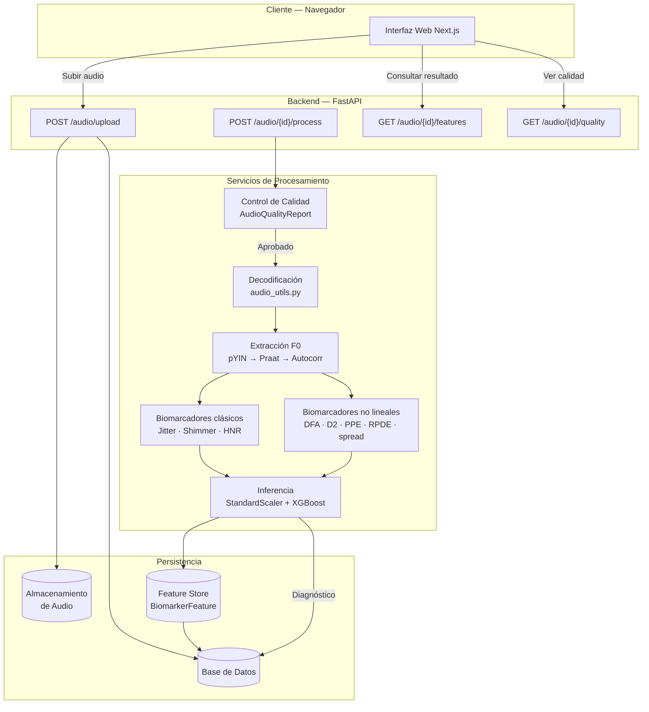
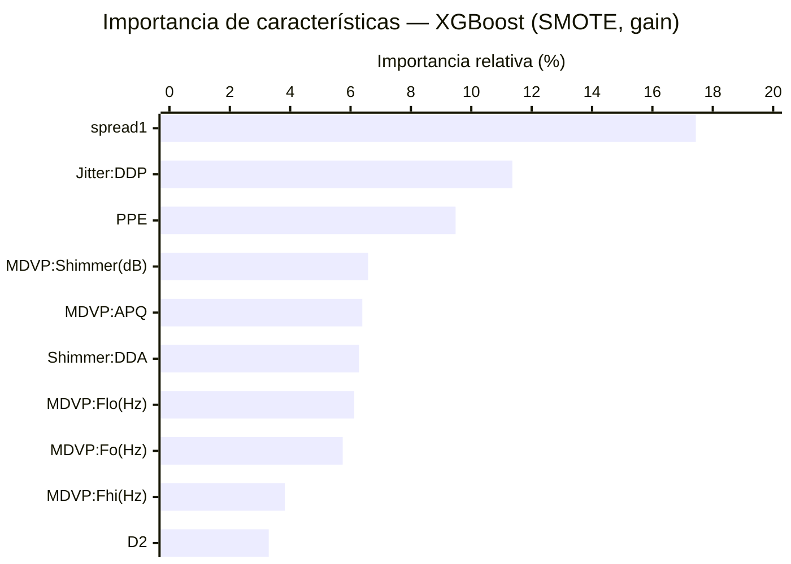
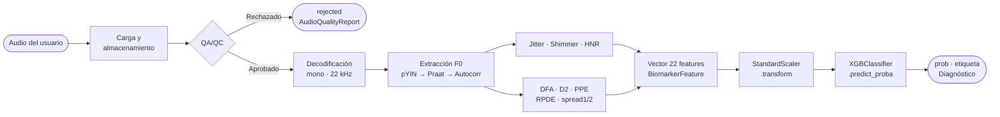

# MedDiag: Plataforma Experimental de Tamizaje de Parkinson Basada en Voz, Control de Calidad y Biomarcadores Acústicos Trazables

Adrián Espinosa — mauricio.espinosa@udea.edu.co
Diana C. Huertas — diana.huertas@udea.edu.co
David Rios — david.rios2@udea.edu.co

---

**Resumen**— MedDiag evoluciona desde un prototipo de apoyo diagnóstico basado en variables clínicas ingresadas manualmente hacia una plataforma académica de tamizaje experimental centrada en captura de voz, control de calidad de la muestra de audio, extracción de biomarcadores acústicos y trazabilidad de inferencia. El proyecto está compuesto por una aplicación web, un backend en FastAPI, almacenamiento de audios, procesamiento digital de señales y modelos de aprendizaje automático orientados al análisis preliminar de patrones vocales asociados a la enfermedad de Parkinson.

El enfoque técnico conserva biomarcadores interpretables porque el modelo histórico de Parkinson fue entrenado con variables acústicas estructuradas, no con audio crudo. Por ello, el reto central no consiste únicamente en recibir archivos de audio desde el usuario, sino en garantizar que las características extraídas sean comparables, reproducibles, auditables y metodológicamente defendibles.

MedDiag incorpora implementaciones determinísticas para biomarcadores no lineales como DFA, D2, PPE, RPDE, spread1 y spread2, que sustituyen aproximaciones no reproducibles de versiones anteriores. Estas implementaciones deben entenderse como una etapa experimental que requiere validación frente a herramientas de referencia y audios controlados. Adicionalmente, la versión actual incorpora un módulo de control de calidad de audio que calcula duración, energía RMS, saturación, relación señal-ruido, proporción de silencio, piso de ruido y ancho de banda antes de permitir la extracción de biomarcadores. Este control de calidad opera como una compuerta metodológica previa a la inferencia y reduce el riesgo de generar predicciones sobre señales inválidas.

En esta fase, MedDiag prioriza reproducibilidad, equivalencia de características, control de calidad, versionamiento y validación experimental antes que complejidad de infraestructura o modelos de caja negra. Parselmouth se consolida como núcleo primario de extracción de biomarcadores clásicos (F0, jitter, shimmer y HNR), mientras que Librosa cumple un rol de soporte en carga y procesamiento digital de señales. Una iteración posterior deberá incorporar datasets más pertinentes para validación externa, especialmente PC-GITA y NeuroVoz. MedDiag se define expresamente como una herramienta académica de apoyo y tamizaje experimental, no como un sistema de diagnóstico clínico.

**Palabras clave**— Parkinson, biomarcadores de voz, FastAPI, Parselmouth, Praat, Librosa, control de calidad de audio, aprendizaje automático, procesamiento digital de señales, tamizaje experimental.

---

## I. Introducción

La enfermedad de Parkinson es un trastorno neurodegenerativo progresivo que afecta el sistema nervioso y produce, entre otras manifestaciones, alteraciones vocales como hipofonía, inestabilidad de la fonación, variación de frecuencia fundamental, perturbaciones de amplitud y cambios en la relación armónico-ruido. Debido a ello, diversos estudios han explorado el uso de medidas acústicas como F0, jitter, shimmer, HNR, NHR, RPDE, DFA, D2 y PPE para construir modelos de clasificación, seguimiento o telemonitoreo de síntomas asociados al Parkinson [1], [2].

Este enfoque es especialmente adecuado para MedDiag porque el modelo histórico de Parkinson fue entrenado sobre variables biomédicas de voz estructuradas y no sobre audio crudo. Por esta razón, la evolución del proyecto no debe entenderse como una simple mejora de interfaz para recibir archivos de audio, sino como una reorganización metodológica alrededor del ciclo completo del biomarcador: captura, preprocesamiento, control de calidad, extracción, persistencia versionada, inferencia y auditoría.

La principal dificultad metodológica no radicó únicamente en construir un endpoint capaz de recibir audio, sino en cerrar la brecha entre el dato usado para entrenar el modelo y el dato generado en producción. En el modelo inicial, las variables acústicas ya estaban previamente calculadas; en la versión actual, esas variables deben obtenerse desde grabaciones reales, con diferencias de micrófono, ruido, duración, intensidad y estabilidad fonatoria. Por tanto, el valor investigativo del proyecto no depende solo de producir una probabilidad de riesgo, sino de demostrar que el pipeline de captura, control de calidad, extracción y versionamiento puede generar biomarcadores comparables, auditables y reproducibles.

Adoptar una ruta basada en biomarcadores interpretables permite mantener trazabilidad sobre las variables que alimentan el modelo, facilita la comparación con datasets clásicos y evita depender prematuramente de enfoques de aprendizaje profundo que requieren grandes volúmenes de audio etiquetado, control de sesgos y validación clínica robusta. En esta etapa, el proyecto prioriza la coherencia entre datos de entrenamiento, extracción en producción y explicación técnica del resultado.

---

## II. Planteamiento del Problema

La enfermedad de Parkinson carece, en la práctica clínica general, de herramientas de tamizaje rápido, accesibles y no invasivas que puedan aplicarse fuera del entorno hospitalario. El análisis de voz representa una alternativa prometedora porque puede realizarse de forma remota a partir de una grabación de audio simple, sin requerir equipamiento especializado.

La versión inicial de MedDiag funcionaba como una aplicación cliente-servidor que recibía un vector de biomarcadores acústicos ya calculados: frecuencia fundamental, jitter, shimmer, HNR y parámetros no lineales, entre otros. Esa arquitectura era suficiente para probar la integración de software, pero dejaba abierto el problema crítico de cómo obtener esos biomarcadores desde audio real capturado en condiciones variables.

Al plantear la evolución hacia análisis de voz real, se identificaron tres riesgos principales:

1. **Ruptura entre entrenamiento e inferencia**: el modelo fue entrenado con variables estructuradas, pero en producción puede recibir valores calculados por métodos diferentes o bajo condiciones de audio no controladas.

2. **Aproximaciones no reproducibles**: algunas variables, especialmente las no lineales, no estaban calculadas de forma reproducible en versiones anteriores.

3. **Imputación silenciosa de valores 0.0**: el sistema podía generar inferencias numéricamente válidas pero biomédicamente incorrectas si completaba variables faltantes con ceros sin reportarlo.

Por tanto, la pregunta técnica central del proyecto se formula así:

> ¿Qué ruta de captura, control de calidad, extracción, versionamiento y validación permite que los biomarcadores usados por el modelo de Parkinson sean comparables con los datos de entrenamiento y suficientemente trazables para una herramienta de tamizaje experimental?

Esta formulación evita reducir el proyecto a una competencia de algoritmos y centra la investigación en la confiabilidad del dato que alimenta el modelo.

---

## III. Objetivos

### A. Objetivo General

Desarrollar y documentar un prototipo web de tamizaje experimental de Parkinson basado en análisis de voz, capaz de capturar o recibir grabaciones de usuario, aplicar control de calidad, extraer biomarcadores acústicos trazables y utilizarlos como entrada de un modelo de aprendizaje automático bajo una lógica de apoyo académico, no de diagnóstico clínico.

### B. Objetivos Específicos

1. Integrar un flujo de carga, almacenamiento y procesamiento de audios dentro de una arquitectura web.
2. Estandarizar el preprocesamiento de audio para reducir variabilidad por formato, frecuencia de muestreo, canales, duración y silencios.
3. Implementar una compuerta de control de calidad previa a la extracción de biomarcadores y a la inferencia.
4. Generar un vector de características acústicas compatible con el esquema del dataset de Parkinson, registrando explícitamente las características faltantes o parciales.
5. Implementar aproximaciones determinísticas para biomarcadores no lineales como DFA, D2, PPE, RPDE, spread1 y spread2.
6. Persistir los biomarcadores extraídos junto con información de versionamiento del extractor, esquema de características y estado de completitud.
7. Ejecutar una predicción preliminar de Parkinson a partir del vector de biomarcadores, delimitando su alcance como resultado experimental.
8. Identificar limitaciones técnicas, metodológicas y clínicas que deben resolverse antes de cualquier interpretación diagnóstica.

---

## IV. Metodología de Investigación Aplicada

Este trabajo se plantea como una investigación aplicada de desarrollo tecnológico, con enfoque experimental y orientación a validación de pipeline. Su propósito no es demostrar validez clínica final, sino construir una ruta técnica defendible para capturar audio, evaluar su calidad, extraer biomarcadores, registrar trazabilidad e integrar los datos con un modelo predictivo existente.

La decisión metodológica central fue adoptar un enfoque basado en biomarcadores acústicos interpretables antes que un enfoque extremo a extremo de aprendizaje profundo. Esta decisión responde a cuatro razones: primero, el modelo histórico de Parkinson espera un vector estructurado de características acústicas. Segundo, los biomarcadores permiten comparar la salida del extractor con literatura previa y herramientas de referencia. Tercero, el proyecto no cuenta aún con un banco amplio de audios etiquetados, metadatos clínicos y consentimiento para entrenar modelos profundos robustos. Cuarto, en un sistema con implicaciones en salud, la trazabilidad del dato de entrada es tan importante como la métrica de clasificación.

La metodología se organiza en seis momentos:

1. **Revisión del estado técnico**: análisis del funcionamiento anterior de MedDiag, del modelo histórico de Parkinson y de la arquitectura actual del sistema.
2. **Selección del enfoque por biomarcadores**: adopción de variables acústicas interpretables para mantener compatibilidad con datasets existentes y facilitar auditoría.
3. **Diseño del pipeline de audio**: definición de una secuencia de captura, decodificación, preprocesamiento, control de calidad, extracción de características, persistencia e inferencia.
4. **Implementación progresiva**: incorporación de Feature Store, versionado del extractor, aproximaciones determinísticas de biomarcadores no lineales, reportes de calidad de audio y endpoints de consulta. El Feature Store es el componente que almacena de forma persistente y versionada el vector de biomarcadores asociado a cada audio procesado.
5. **Delimitación de alcance**: definición del sistema como tamizaje experimental, no como diagnóstico clínico.
6. **Identificación de brechas**: documentación de riesgos asociados a equivalencia de medidas, ruido, micrófonos, datasets limitados, validación clínica y manejo de características faltantes.

Este enfoque permite separar el logro de ingeniería —tener un flujo funcional— del reto científico —validar que los biomarcadores extraídos sean equivalentes, estables y clínicamente interpretables.

---

## V. Marco Conceptual

### A. Biomarcadores de Voz en Parkinson

La hipofonía, la inestabilidad de la frecuencia fundamental y los cambios en la calidad vocal pueden reflejar afectaciones del control motor del habla. Por ello, las grabaciones de vocal sostenida han sido usadas como fuente de características acústicas para modelos de clasificación [1]. La vocal sostenida /a/ es la más utilizada en la literatura porque su producción estacionaria facilita el cálculo estable de perturbaciones de frecuencia y amplitud, reduciendo la variabilidad introducida por el habla continua.

El conjunto de 22 biomarcadores que usa MedDiag, compatible con el dataset Oxford Parkinson's Disease Detection, se muestra en la Tabla I.

| Categoría | Variables |
|---|---|
| Frecuencia | MDVP:Fo(Hz), MDVP:Fhi(Hz), MDVP:Flo(Hz) |
| Jitter | MDVP:Jitter(%), MDVP:Jitter(Abs), MDVP:RAP, MDVP:PPQ, Jitter:DDP |
| Shimmer | MDVP:Shimmer, MDVP:Shimmer(dB), Shimmer:APQ3, Shimmer:APQ5, MDVP:APQ, Shimmer:DDA |
| Ruido-armonicidad | NHR, HNR |
| No lineales | RPDE, DFA, spread1, spread2, D2, PPE |

**Tabla I**: Conjunto de 22 biomarcadores acústicos del pipeline de MedDiag, compatibles con el dataset Oxford Parkinson's Disease Detection [7].

Estos valores no deben asumirse como equivalentes entre herramientas distintas. El valor obtenido depende del algoritmo, de los parámetros de extracción, de la calidad del audio, de la frecuencia de muestreo y de las condiciones de grabación [3].

### B. Jitter, Shimmer y HNR

El jitter representa variaciones ciclo a ciclo de la frecuencia fundamental. El shimmer describe variaciones ciclo a ciclo de la amplitud. El HNR (Harmonics-to-Noise Ratio) expresa la relación entre los componentes armónicos y el ruido en la señal de voz [8]. Estas medidas son sensibles a la calidad de la grabación y a la configuración del algoritmo de extracción, por lo que no deben interpretarse de manera aislada ni como equivalentes directos entre herramientas distintas [9].

Praat es una herramienta ampliamente usada para análisis acústico de voz, y Parselmouth permite acceder a sus funcionalidades desde Python [4], [5]. Por esta razón, Parselmouth/Praat constituye la ruta recomendada para calcular F0, jitter, shimmer y HNR en el extractor del proyecto.

### C. Biomarcadores No Lineales

Las variables no lineales buscan capturar propiedades complejas de la señal vocal que no siempre son evidentes en medidas lineales tradicionales. MedDiag implementa:

- **DFA** (Detrended Fluctuation Analysis): analiza fluctuaciones de la señal tras remover tendencias locales, capturando correlaciones de largo alcance.
- **D2**: aproxima la dimensión de correlación mediante una estrategia tipo Grassberger-Procaccia, que mide la complejidad geométrica de la dinámica vocal.
- **PPE** (Pitch Period Entropy): estima la entropía de la distribución del pitch en escala logarítmica, cuantificando la irregularidad del período de pitch.
- **RPDE** (Recurrence Period Density Entropy): aproxima la entropía de densidad de periodos recurrentes a partir de retardos de recurrencia, midiendo la aperiodicidad de la señal.
- **spread1 y spread2**: describen el desplazamiento y la dispersión de la distribución del log-pitch.

Estas variables enriquecen el vector de entrada del modelo, pero en el estado actual deben entenderse como aproximaciones experimentales que requieren comparación frente a implementaciones de referencia y audios controlados [2].

### D. Librosa como Soporte de Procesamiento Digital de Señales

Librosa es una biblioteca de Python ampliamente usada para análisis de audio, carga de señales, extracción espectral y procesamiento digital de señales [6]. En MedDiag, su papel es de soporte: carga, preprocesamiento y análisis auxiliar. No debe usarse como sustituto de Praat para jitter, shimmer o HNR, ya que estas medidas requieren algoritmos específicos de perturbación vocal.

### E. Gradient Boosting y XGBoost

El gradient boosting es un método de aprendizaje supervisado que construye un modelo predictivo combinando secuencialmente aprendices débiles, típicamente árboles de decisión poco profundos. En cada iteración t, la predicción se actualiza como:

F_t(x) = F_{t-1}(x) + η · h_t(x)

donde h_t(x) es el árbol que aproxima el gradiente negativo de la función de pérdida y η es la tasa de aprendizaje que controla la contribución de cada árbol y previene el sobreajuste [18].

XGBoost (eXtreme Gradient Boosting), propuesto por Chen y Guestrin [17], extiende este marco con regularización L1 y L2 para reducir el sobreajuste, manejo nativo de valores faltantes, métricas de importancia de características (gain, cover, frequency) e interpolación cuantil ponderada para determinar puntos de corte óptimos de forma eficiente.

---

## VI. Ruta Técnica Actual

La ruta actual se organiza en capas progresivas, como se describe en la Tabla II.

| Capa | Elección actual | Justificación | Riesgo controlado |
|---|---|---|---|
| Captura de voz | Vocal sostenida /a/ | Reduce variabilidad y facilita el cálculo de perturbaciones de F0 y amplitud | Muestras no comparables |
| Preprocesamiento | Mono, frecuencia de muestreo controlada y decodificación robusta | Estandariza la señal antes de extraer biomarcadores | Sesgos por dispositivo o formato |
| Control de calidad | AudioQualityReport con duración, RMS, clipping, SNR, silencio, piso de ruido y ancho de banda | Bloquea o marca señales no aptas antes de la extracción | Inferencias sobre audio inválido |
| Extracción base | Librosa, SciPy y Pydub | Carga, compatibilidad y cálculos auxiliares | Fallos de formato o pipeline rígido |
| Extracción clínica objetivo (ver XVI.1) | Parselmouth/Praat | Ruta defendible para F0, jitter, shimmer y HNR; estado actual usa Librosa/pYIN como método principal | Desviación de medidas vocales |
| Biomarcadores no lineales | Implementaciones determinísticas | Completa el vector histórico del modelo | Placeholders y variables incompletas |
| Persistencia | Feature Store con versión de extractor y esquema | Permite auditoría y comparación entre corridas | Resultados no trazables |
| Inferencia | Modelo actual de Parkinson (XGBoost) | Reutiliza el clasificador disponible | Entrada incompatible con entrenamiento |

**Tabla II**: Organización por capas de la ruta técnica actual de MedDiag.

La decisión metodológica más importante es separar responsabilidades: el audio no es el centro del sistema; el centro es la confiabilidad del biomarcador que llega al modelo.

---

## VII. Arquitectura del Sistema

MedDiag utiliza una arquitectura web dividida en frontend, backend, servicios de procesamiento y persistencia.

### A. Frontend

El frontend está construido en Next.js. Permite autenticación, acceso a rutas privadas, carga de audios y consulta de registros procesados. La aplicación ofrece una interfaz para que el usuario grabe o suba una muestra de voz, revise su estado de procesamiento y consulte los biomarcadores extraídos.

### B. Backend

El backend está construido con FastAPI. Expone los siguientes endpoints REST:

- `POST /audio/upload` — Carga de audio
- `GET /audio/me` — Listar audios del usuario
- `GET /audio/{audio_id}` — Consultar un audio específico
- `POST /audio/{audio_id}/process` — Procesar un audio
- `GET /audio/{audio_id}/features` — Obtener biomarcadores
- `GET /audio/{audio_id}/quality` — Consultar el último reporte de calidad
- `POST /audio/{audio_id}/quality/check` — Ejecutar o repetir control de calidad
- `POST /audio/batch-process` — Procesar lotes de audios
- `GET /audio/analysis/summary` — Resumen de análisis

### C. Almacenamiento y Trazabilidad

El sistema guarda los archivos de audio en un backend de almacenamiento configurable y registra metadatos en base de datos. Cada audio conserva información como usuario, nombre original, tipo MIME, tamaño, ruta de almacenamiento, estado de procesamiento, notas y marcas temporales.

La entidad `BiomarkerFeature` almacena el conjunto de biomarcadores asociado a un audio, junto con `extractor_version`, `feature_schema_version`, `features_json`, `missing_features_json` e `is_partial`. Esta separación permite auditar los resultados y comparar versiones del extractor.

La entidad `AudioQualityReport`, asociada a cada registro de audio, almacena el veredicto de calidad (`is_valid`), la puntuación (`quality_score`), la razón de rechazo y métricas de señal: duración, energía RMS, amplitud pico, recorte, SNR, proporción de silencio, piso de ruido y ancho de banda. Con ello, el sistema convierte la calidad del audio en un artefacto persistido y consultable, no en una simple advertencia documental.



**Figura 1**: Arquitectura general de MedDiag. El frontend Next.js se comunica con los endpoints REST del backend FastAPI, que coordina el pipeline de procesamiento, la persistencia en Feature Store y la inferencia sobre el modelo XGBoost.

---

## VIII. Funcionamiento del Módulo de Análisis de Voz

### A. Carga del Audio

El usuario envía un archivo de audio al endpoint de carga. El sistema valida tipo y tamaño, guarda el archivo en almacenamiento y crea un registro en base de datos. Luego marca el audio como `processing` y ejecuta el procesamiento en segundo plano.

### B. Decodificación

El servicio intenta cargar el audio con Librosa. Si la decodificación falla y Pydub está disponible, lo utiliza como mecanismo alternativo. El sistema exige una duración mínima de 0.5 segundos para evitar procesar muestras demasiado cortas.

### C. Control de Calidad de Audio

Antes de extraer biomarcadores, el pipeline ejecuta una compuerta de control de calidad. Este módulo carga el audio, lo decodifica y calcula métricas de validez de señal: duración mínima, razón de recorte, energía RMS, proporción de silencio y relación señal-ruido. También estima piso de ruido y ancho de banda ocupado.

El resultado se persiste como `AudioQualityReport`. Si el audio supera el control, el estado avanza a `quality_checked` y continúa hacia la extracción de biomarcadores. Si falla, se marca como `rejected` con una explicación: duración insuficiente, saturación, baja energía, exceso de silencio o SNR deficiente. Esta compuerta evita que el modelo reciba vectores derivados de señales degradadas.

```
FUNCIÓN analizar_calidad(registro_audio):
  señal, sr ← decodificar(registro_audio, tasa_nativa)
  duración ← longitud(señal) / sr
  SI duración < 0.8 s → RECHAZAR("Duración insuficiente")

  rms          ← √(media(señal²))
  pico         ← max(|señal|)
  razón_recorte ← #{|señal| ≥ 0.98} / longitud(señal)
  SI razón_recorte > 0.01 → RECHAZAR("Saturación detectada")
  SI rms < 0.005         → RECHAZAR("Energía insuficiente")

  tramas        ← segmentar(señal, marco=20 ms)
  razón_silencio ← #{rms_trama < 0.01·pico} / #{tramas}
  SI razón_silencio > 0.60 → RECHAZAR("Exceso de silencio")

  snr_db ← 20·log10(media(RMS_top25%) / media(RMS_bot25%))
  SI snr_db < 10 dB → RECHAZAR("SNR insuficiente")

  RETORNAR aprobado(puntuación, métricas)
```

**Pseudocódigo 1**: Compuerta QA/QC de `quality_control.py`. Los umbrales son configurables y deben validarse con audios controlados (ver XVI.3).

### D. Extracción de Frecuencia Fundamental

La frecuencia fundamental se estima mediante una estrategia escalonada: primero `librosa.pyin` como método principal; luego Parselmouth/Praat como alternativa si no se obtiene F0; finalmente autocorrelación con SciPy como último recurso. A partir de F0 se calculan frecuencia mediana, máxima y mínima.

```
FUNCIÓN extraer_F0(señal, sr, fmin=75 Hz, fmax=300 Hz):

  // Ruta 1: pYIN — método principal
  INTENTAR:
    f0 ← librosa.pyin(señal, fmin, fmax, sr, marco=2048, salto=512)
    válidos ← f0[NOT NaN]
    SI longitud(válidos) > 0 → RETORNAR válidos  // registrar ruta usada

  // Ruta 2: Parselmouth/Praat — respaldo clínico recomendado
  INTENTAR:
    sonido ← parselmouth.Sound(señal, sr)
    pitch  ← sonido.to_pitch(paso=10 ms, piso=fmin, techo=fmax)
    válidos ← pitch.frecuencias[> 0]
    SI longitud(válidos) > 0 → RETORNAR válidos

  // Ruta 3: Autocorrelación — último recurso
  INTENTAR:
    PARA CADA trama de 2048 muestras, salto 512:
      autocorr ← correlate(trama, trama)
      pico     ← primer_pico(autocorr[1 : N/2])
      SI pico > 0 Y fmin ≤ sr/pico ≤ fmax:
        AGREGAR sr/pico
    SI resultado ≠ vacío → RETORNAR resultado

  LANZAR AudioProcessingError("Sin F0 disponible")
```

**Pseudocódigo 2**: Estrategia escalonada de extracción de F0 en `audio_processing.py`. La ruta utilizada se registra en log para facilitar la auditoría del extractor.

### E. Extracción de Biomarcadores

El extractor calcula o aproxima jitter y medidas derivadas (RAP, PPQ, DDP), shimmer y medidas derivadas (APQ3, APQ5, APQ, DDA), NHR y HNR mediante una aproximación cepstral, y los biomarcadores no lineales (DFA, D2, PPE, RPDE, spread1 y spread2).

Cuando una característica no puede calcularse, el uso transitorio de 0.0 mantiene la compatibilidad técnica del vector. No obstante, la ruta recomendada es registrar la variable en `missing_features_json`, marcar el conjunto como `is_partial = true` y decidir si se rechaza la muestra, se solicita nueva grabación o se ejecuta una inferencia explícitamente marcada como parcial.

```
FUNCIÓN calcular_biomarcadores_nolineales(señal, f0):
  features ← {}
  faltantes ← []

  INTENTAR:
    // DFA: fluctuaciones de la señal integrada en ventanas log-espaciadas
    y ← cumsum(señal − media(señal))
    PARA CADA ventana w en log_space(8, N/4, n=16):
      segmentos ← dividir(y, w)
      flucts.agregar(rms_residuos_polinomiales(segmentos))
    features["DFA"] ← pendiente(log(ventanas), log(flucts))
  EXCEPTO → faltantes.agregar("DFA")

  INTENTAR:
    // D2: dimensión de correlación (Grassberger-Procaccia)
    emb ← reconstruir_espacio_fases(señal, m=3, τ=2, max=350 pts)
    radios ← log_space(p5(dist), p35(dist), n=14)
    PARA CADA r: C(r) ← #{pares con dist < r} / total_pares
    features["D2"] ← pendiente(log(radios), log(C(r)))
  EXCEPTO → faltantes.agregar("D2")

  INTENTAR:
    // PPE: entropía del histograma de log-pitch centrado
    lp ← log(f0) − media(log(f0))
    p  ← histograma_normalizado(lp, bins=30)
    features["PPE"] ← −Σ p·log(p) / log(30)
  EXCEPTO → faltantes.agregar("PPE")

  INTENTAR:
    // RPDE: entropía de rezagos de primer retorno sobre periodos
    periodos ← normalizar(1/f0)
    rezagos  ← primer_retorno_dentro(periodos, ε=0.2, max_lag=120)
    p ← histograma_normalizado(rezagos)
    features["RPDE"] ← −Σ p·log(p) / log(120)
  EXCEPTO → faltantes.agregar("RPDE")

  INTENTAR:
    // spread1/spread2: descriptores distribucionales sobre log-pitch centrado
    lp      ← log(f0) − mediana(log(f0))
    features["spread1"] ← percentil(lp, 10)
    features["spread2"] ← 0.5·(p90 − p10) + 0.5·IQR(lp)
  EXCEPTO → faltantes.extender(["spread1", "spread2"])

  RETORNAR features, faltantes
```

**Pseudocódigo 3**: Extracción de biomarcadores no lineales en `nonlinear_features.py`. Cada función falla de forma independiente; los fallos se reportan en `faltantes` sin silenciarse con 0.0 (ver XVI.4).

### F. Inferencia Preliminar

Una vez generado el vector de biomarcadores, el pipeline valida que las características esperadas estén presentes y sean finitas. Luego invoca el modelo de Parkinson y genera un registro de diagnóstico preliminar con probabilidad asociada. El resultado se expresa como orientación experimental, no como diagnóstico médico.

---

## IX. Avances Implementados

### A. Biomarcadores No Lineales Determinísticos

La rama `marcadoresNL` implementa funciones determinísticas para `compute_dfa`, `compute_d2`, `compute_ppe`, `compute_rpde` y `compute_spread_features`. Este avance permite que el sistema calcule los seis biomarcadores no lineales esperados por el esquema de Parkinson, en lugar de depender de valores por defecto o placeholders.

### B. Mayor Trazabilidad

El sistema persiste los biomarcadores en una entidad específica de base de datos. Cada conjunto de características queda asociado al audio procesado, a la versión del extractor y a la versión del esquema, lo que facilita auditoría, reproducción de resultados y comparación entre iteraciones.

### C. Control de Calidad de Audio

Se implementó un servicio dedicado que analiza la señal antes de la extracción. El servicio calcula duración, energía RMS, amplitud pico, razón de recorte, SNR estimada, proporción de silencio, piso de ruido y ancho de banda. Los resultados se persisten en `audio_quality_reports`. Si el audio no cumple las condiciones mínimas, el sistema registra el motivo y evita continuar con una inferencia ordinaria, lo que convierte una limitación conocida en una funcionalidad implementada.

### D. Integración con Flujo de Usuario

El procesamiento de audio está integrado con endpoints protegidos por autenticación. Cada usuario puede cargar, listar y consultar sus propios audios. El sistema contempla control de acceso para que solo el propietario o un administrador puedan ver registros específicos.

### E. Procesamiento Asincrónico

Después de la carga, el audio se procesa en segundo plano. Esto mejora la experiencia de usuario, ya que la solicitud de carga no queda bloqueada hasta que termine la extracción de biomarcadores.

### F. Compatibilidad con el Modelo Existente

El pipeline conserva el esquema de 22 variables del modelo de Parkinson ya entrenado. Esto permite reutilizar el modelo actual mientras se mejora progresivamente la calidad de la extracción. Sin embargo, esta compatibilidad no debe confundirse con validación clínica.

---

## X. Datasets para Fortalecimiento del Modelo y Validación Externa

El dataset clásico de Parkinson (UCI) constituye una línea base útil para reproducir el modelo histórico de MedDiag, pero su tamaño reducido y la ausencia de audio crudo limitan la posibilidad de validar el pipeline completo de captura, preprocesamiento, extracción y control de calidad.

Por esta razón, MedDiag debe incorporar una estrategia progresiva de evaluación con datasets más pertinentes. En el contexto colombiano, PC-GITA es especialmente relevante porque fue construido con hablantes nativos de español colombiano, incluyendo 50 pacientes con Parkinson y 50 controles sanos emparejados por edad y género [11]. Este corpus permitiría evaluar vocal sostenida, palabras, frases, lectura y habla continua en una población lingüísticamente cercana al contexto de uso del proyecto.

Como complemento, NeuroVoz es una opción importante para evaluar generalización en otra variante del español. Este corpus incluye hablantes nativos de español castellano con tareas de fonación sostenida, pruebas diadococinéticas, frases y monólogos [12]. La combinación de PC-GITA y NeuroVoz permitiría discutir la estabilidad de los biomarcadores entre variantes del español y fortalecer la validez externa del sistema.

Finalmente, datasets de mayor escala como mPower pueden reservarse para una fase avanzada orientada a robustez frente a audio de smartphone y ruido ambiental [13]. Por su heterogeneidad y complejidad de curaduría, no deberían desplazar en la fase actual a corpus más controlados y lingüísticamente pertinentes.

| Dataset | Utilidad para MedDiag | Ventaja principal | Limitación |
|---|---|---|---|
| UCI Parkinson clásico | Línea base histórica | Compatible con el modelo actual de 22 variables | Tamaño reducido; uso habitual sin audio crudo |
| UCI Multiple Audio | Prueba intermedia de tareas vocales | Incluye distintos tipos de grabación | Pocos sujetos |
| PC-GITA | Validación contextual para Colombia | Español colombiano, pacientes y controles | Puede requerir acceso académico |
| NeuroVoz | Validación externa en español | Corpus reciente en español castellano | Variante lingüística diferente a Colombia |
| mPower | Robustez y audio móvil | Gran volumen de datos | Alta heterogeneidad y curaduría exigente |

**Tabla III**: Datasets considerados para validación externa del pipeline de MedDiag.

---

## XI. Modelo de Producción: XGBoost para Clasificación de Parkinson

El modelo de producción actual de MedDiag para la clasificación de Parkinson es un XGBClassifier entrenado sobre las 22 características acústicas del dataset UCI Oxford. Este modelo reemplazó al SVC con kernel RBF que operaba en versiones anteriores.

### A. Funcionamiento del Algoritmo XGBoost

XGBoost construye árboles de forma secuencial, donde cada nuevo árbol se enfoca en corregir los errores residuales del conjunto anterior. A diferencia de Random Forest [19], que construye árboles de forma independiente, XGBoost aplica regularización L1 y L2 incorporada, lo que reduce el sobreajuste en conjuntos pequeños como el de Parkinson (197 muestras). Adicionalmente, el algoritmo maneja de forma nativa los valores faltantes, lo que resulta relevante cuando el pipeline de extracción no puede calcular todas las 22 variables. Las métricas de importancia de características (gain, cover, frequency) permiten identificar qué biomarcadores acústicos contribuyen más a la decisión del modelo, facilitando la interpretabilidad y la auditoría del extractor.

### B. Justificación de la Elección

La Tabla IV compara XGBoost con las alternativas evaluadas.

| Aspecto | XGBoost | SVM (RBF) | Random Forest | Regresión Logística |
|---|---|---|---|---|
| Rendimiento en datos tabulares pequeños | Alto [21], [22] | Bueno, pero sensible a escalamiento | Bueno, pero propenso a sobreajuste | Moderado |
| Captura de no linealidades | Sí, mediante árboles | Sí, mediante kernel | Sí, con riesgo de sobreajuste | Limitada |
| Importancia de características | Nativa (gain, cover, frequency) | Requiere métodos externos | Nativa (impurity-based) | Coeficientes directos |
| Regularización | L1 + L2 incorporada | Parámetro C | Profundidad y min_samples | Parámetro C |
| Robustez a características correlacionadas | Alta | Baja | Alta | Baja |
| Probabilidades calibradas | Requiere calibración adicional | Nativa con probability=True | Nativa | Nativa |

**Tabla IV**: Comparación de XGBoost con alternativas consideradas para el pipeline de MedDiag.

Estudios comparativos en clasificación de Parkinson a partir de biomarcadores de voz reportan que XGBoost supera consistentemente a SVM, Random Forest y regresión logística en accuracy, F1-score y AUC-ROC [21], [22]. Sakar et al. [22] reportaron accuracy superior al 95% con métodos basados en boosting sobre el dataset UCI de Parkinson. Por otra parte, la regularización L1/L2 de XGBoost, combinada con la poda de árboles, ofrece un control más fino sobre el sobreajuste que otras alternativas, lo cual resulta crítico con solo 197 muestras de entrenamiento.

El modelo actual fue entrenado con los hiperparámetros por defecto de XGBoost, con balanceo de clases mediante SMOTE y validación cruzada estratificada de 5 pliegues. La búsqueda sistemática de hiperparámetros queda como trabajo futuro (ver XVI.10).

La Figura 3 muestra la importancia relativa de cada característica calculada desde el modelo entrenado (métrica *gain*: reducción total de impureza aportada por cada variable). Las características con mayor contribución son `spread1`, `Jitter:DDP` y `PPE`, lo que es consistente con hallazgos previos sobre la relevancia de descriptores no lineales y de distribución del pitch en Parkinson [2], [22].



**Figura 3**: Las 10 características más importantes del modelo XGBoost de Parkinson (las 12 restantes suman 14.02%). El dominio de `spread1` y los descriptores de jitter confirma que el modelo pondera fuertemente los biomarcadores distribucionales y de perturbación de pitch, reforzando la tesis de trazabilidad del pipeline de extracción.

### C. Pipeline de Inferencia en Producción

El pipeline completo sigue la secuencia reflejada en la Figura 2 y el Pseudocódigo 4. El modelo está serializado en `parkinsons_model_smote.sav` y el escalador en `parkinsons_scaler_smote.sav`; ambos se cargan en memoria al iniciar el servicio mediante `joblib.load`, de modo que la inferencia no requiere reentrenamiento por solicitud.



**Figura 2**: Diagrama de flujo del pipeline de datos de MedDiag. La compuerta QA/QC es el único punto de rechazo duro antes de la extracción de biomarcadores.

```
FUNCIÓN pipeline_completo(registro_audio, usuario):

  // 1. Compuerta QA/QC
  reporte ← analizar_calidad(registro_audio)
  SI NOT reporte.válido:
    actualizar_estado(registro_audio, "rejected")
    LANZAR PipelineError(reporte.motivo)

  // 2. Carga y extracción
  bytes_audio ← backend.cargar(registro_audio.ruta)
  features, faltantes ← extraer_biomarcadores(bytes_audio)

  // 3. Sanear NaN/inf y validar rango UCI
  inválidos  ← [f PARA f EN features SI NOT finito(features[f])]
  faltantes  ← faltantes ∪ inválidos
  features   ← sanitizar_a_rango_uci(features \ inválidos)
  SI calidad_features(features) < umbral:
    persistir(features, faltantes, parcial=True)
    LANZAR PipelineError("Extracción no confiable")

  // 4. Persistencia en Feature Store (versionada)
  feature_set ← persistir(
    registro_audio.id, features, faltantes,
    versión_extractor, versión_esquema
  )

  // 5. Inferencia
  x       ← vector_ordenado(features, PARKINSON_FEATURE_ORDER)  // 22 valores
  x_sc    ← StandardScaler.transform(x)
  prob    ← XGBClassifier.predict_proba(x_sc)[clase=1]
  etiqueta ← 1 SI prob ≥ 0.85 SINO 0

  // 6. Diagnóstico y cierre
  diagnóstico ← crear_diagnóstico(usuario, etiqueta, prob)
  actualizar_estado(registro_audio, "processed")
  RETORNAR {features, faltantes, diagnóstico.id, prob}
```

**Pseudocódigo 4**: Pipeline principal en `audio_pipeline.py`. El umbral de decisión 0.85 fue ajustado empíricamente para mejorar el balance sensibilidad/especificidad en condiciones de audio real. El StandardScaler se mantiene del pipeline anterior para consistencia con el flujo de datos existente.

### D. Modelos Adicionales Disponibles

El repositorio incluye como respaldo un `VotingClassifier` que combina XGBoost, Random Forest y Regresión Logística mediante votación blanda (soft voting). Este ensemble no está activo en producción, pero puede activarse para evaluar si la combinación de modelos mejora la estabilidad de las predicciones.

### E. Consideración sobre Deep Learning

La decisión de no iniciar con modelos profundos de audio no es una renuncia tecnológica, sino una decisión metodológica. Modelos como Wav2Vec2, HuBERT o WavLM aprenden representaciones directamente desde la forma de onda, pero requieren un banco amplio de audios etiquetados (idealmente más de 1000 muestras), metadatos clínicos y control de sesgos. En la fase actual, el enfoque por biomarcadores permite explicar qué variables alimentan el modelo, comparar valores entre extractores y detectar errores de señal. Estos modelos se reservan para una etapa posterior con mayor disponibilidad de datos.

### F. Métricas de Evaluación

Dado que MedDiag utiliza modelos predictivos con posible interpretación en salud, su evolución debe alinearse progresivamente con guías de reporte y evaluación de riesgo de sesgo. TRIPOD+AI ofrece recomendaciones para reportar modelos predictivos desarrollados con regresión o aprendizaje automático [14], mientras que PROBAST+AI permite evaluar calidad, aplicabilidad y riesgo de sesgo [15].

| Métrica | Uso en MedDiag | Justificación |
|---|---|---|
| Recall / sensibilidad | Prioritaria | En tamizaje interesa reducir falsos negativos |
| F1-score | Comparación balanceada | Útil si hay desbalance de clases |
| AUC-ROC | Discriminación global | Evalúa separación entre clases |
| Matriz de confusión | Interpretación de errores | Permite observar falsos positivos y negativos |
| Calibración | Interpretación de probabilidades | Evita tratar probabilidades mal calibradas como riesgo clínico real |
| Validación cruzada | Estabilidad interna | Reduce dependencia de una sola partición |
| Validación externa | Generalización | Evalúa desempeño en datasets distintos |

**Tabla V**: Métricas recomendadas para evaluación de modelos en MedDiag.

---

## XII. Hallazgos Técnicos

1. **La aplicación evolucionó hacia un laboratorio de voz**. Aunque MedDiag nació como sistema de apoyo diagnóstico para varias enfermedades, el componente más novedoso en esta iteración es el módulo de Parkinson por voz.

2. **El vector del modelo condiciona el pipeline**. El modelo exige 22 características, lo que obliga a producir, marcar o rechazar todas las variables esperadas.

3. **Las variables no lineales son el principal punto de avance**. La rama `marcadoresNL` reduce una debilidad de versiones anteriores al calcular RPDE, DFA, D2, PPE, spread1 y spread2 mediante aproximaciones determinísticas, eliminando los placeholders aleatorios previos.

4. **Parselmouth sigue siendo una ruta metodológica recomendada**. Aunque el pipeline actual usa Librosa como ruta principal para F0, Parselmouth/Praat debe fortalecerse como extractor primario para jitter, shimmer y HNR [4].

5. **La calidad del audio es determinante**. Grabaciones cortas, ruidosas, saturadas o con poca fonación pueden producir valores poco confiables.

6. **La inferencia ahora depende del estado de calidad**. La versión actual implementa una compuerta QA/QC que persiste reportes y puede rechazar audios antes de calcular biomarcadores.

7. **La trazabilidad se amplió de biomarcadores a calidad de señal**. El proyecto ya no solo guarda el vector de características; también registra las condiciones bajo las cuales fue obtenido.

8. **Las brechas identificadas son un entregable en sí mismas**. Como resultado del momento metodológico 6, el proyecto consolida y documenta los siguientes riesgos: (a) equivalencia de medidas entre herramientas de extracción [3], [9]; (b) sensibilidad del audio a condiciones de grabación y ruido ambiental; (c) dataset de entrenamiento reducido (197 muestras) insuficiente para generalización clínica [7]; (d) alcance del sistema como tamizaje experimental, no como diagnóstico clínico; y (e) uso transitorio de 0.0 como valor por defecto para características no calculables.

---

## XIII. Resultados del Desarrollo

Al culminar el desarrollo se obtuvo una herramienta funcional de tamizaje experimental de Parkinson. Los principales resultados son:

1. Endpoint de carga de audio con validación básica.
2. Almacenamiento de archivos y metadatos.
3. Procesamiento de audio en segundo plano.
4. Generación de un vector de 22 características compatible con el modelo histórico de Parkinson.
5. Implementación de biomarcadores no lineales determinísticos en la rama `marcadoresNL`.
6. Implementación de tabla `audio_quality_reports` y modelo `AudioQualityReport`.
7. Servicio de control de calidad con métricas de señal y veredicto `is_valid`.
8. Endpoints para consultar y ejecutar control de calidad por audio.
9. Endpoint de consulta de características extraídas.
10. Generación de predicción preliminar con probabilidad asociada.
11. Documentación técnica sobre librerías, riesgos y ruta de investigación.

El proyecto conserva modelos previamente entrenados para diabetes y enfermedad cardiovascular, pero el aporte principal de esta iteración corresponde al fortalecimiento del módulo de Parkinson por voz.

---

## XIV. Discusión

MedDiag demuestra que es posible integrar en una aplicación web un flujo completo de análisis de voz: captura, almacenamiento, control de calidad, extracción de biomarcadores, inferencia y visualización de resultados. Este logro es relevante desde el punto de vista académico porque combina ingeniería de software, ciencia de datos, procesamiento digital de señales y salud digital.

Sin embargo, el valor del prototipo no debe medirse únicamente por la existencia de una predicción. En aplicaciones de inteligencia artificial en salud, una predicción sin control sobre los datos de entrada puede generar interpretaciones erróneas. El módulo de QA/QC implementado fortalece la trazabilidad porque permite diferenciar entre un audio apto para análisis, un audio rechazado y un conjunto de biomarcadores potencialmente parcial.

La implementación de biomarcadores no lineales mejora la coherencia entre el modelo entrenado y el pipeline de inferencia. Sin embargo, las fórmulas actuales deben considerarse aproximaciones prácticas; su validación científica exigiría comparar sus salidas con herramientas de referencia, utilizar audios controlados y evaluar estabilidad intra-sujeto e inter-sujeto.

La decisión de no iniciar con deep learning extremo a extremo no es una renuncia tecnológica. En ausencia de un banco amplio de audios etiquetados con consentimiento, metadatos clínicos y control de sesgos, un modelo profundo puede ofrecer buen desempeño aparente sin trazabilidad suficiente. En su lugar, el extractor basado en biomarcadores permite comparar valores, detectar errores, explicar inferencias y justificar ajustes del modelo.

---

## XV. Limitaciones

1. **No es diagnóstico clínico**: MedDiag solo entrega una estimación preliminar de riesgo y no reemplaza evaluación neurológica, fonoaudiológica ni médica.
2. **Dataset histórico limitado**: el modelo actual se apoya en un dataset público de 197 muestras, útil como línea base pero insuficiente para afirmar generalización clínica [7].
3. **Diferencia entre entrenamiento y producción**: el modelo fue entrenado con variables ya extraídas, mientras que MedDiag produce esas variables desde audio real capturado en condiciones variables.
4. **Sensibilidad al audio**: ruido, micrófono, distancia, intensidad vocal, duración y estabilidad de la fonación afectan los biomarcadores.
5. **Equivalencia no garantizada entre herramientas**: jitter, shimmer, HNR y otras medidas pueden variar según software, configuración y método de extracción.
6. **Biomarcadores no lineales en etapa experimental**: aunque ahora son determinísticos, requieren comparación con referencias y validación de estabilidad.
7. **Valores por defecto y características parciales**: el uso de 0.0 para completar variables faltantes debe eliminarse o restringirse a ejecuciones marcadas explícitamente como parciales.
8. **Control de calidad heurístico**: los umbrales actuales de QA/QC deben validarse con audios controlados, distintos micrófonos y escenarios reales.
9. **Falta de validación externa**: aún se requiere probar el modelo en datasets diferentes, idealmente PC-GITA o NeuroVoz.
10. **Riesgo de sobreinterpretación**: el usuario podría interpretar una probabilidad experimental como diagnóstico si la interfaz no comunica claramente el alcance.

---

## XVI. Recomendaciones y Trabajo Futuro

1. Consolidar Parselmouth/Praat como extractor principal para F0, jitter, shimmer y HNR.
2. Mantener Librosa como soporte de carga, preprocesamiento y análisis espectral.
3. Validar experimentalmente los umbrales del módulo de control de calidad.
4. Eliminar la imputación silenciosa con 0.0 y usar `missing_features_json`, `is_partial` y estados explícitos de características parciales.
5. Diseñar una batería experimental con vocal sostenida /a/, duración de 3 a 5 segundos, tres repeticiones por sujeto y condiciones controladas de ruido.
6. Comparar Parselmouth, openSMILE [16], DisVoice y Librosa/SciPy en términos de completitud, estabilidad, tiempo de procesamiento y plausibilidad fisiológica.
7. Incorporar PC-GITA como dataset prioritario de validación para población colombiana [11].
8. Incorporar NeuroVoz como dataset externo en español para evaluar generalización lingüística [12].
9. Reentrenar o calibrar modelos solo con características realmente medidas por el pipeline definitivo.
10. Evaluar Random Forest, SVM, Regresión Logística y XGBoost bajo validación cruzada y validación externa.
11. Reportar futuros modelos siguiendo criterios de TRIPOD+AI [14] y evaluar riesgo de sesgo con PROBAST+AI [15].
12. Explorar Wav2Vec2, HuBERT o WavLM solo cuando exista un banco suficiente de audios etiquetados y controlados.
13. Incorporar en la interfaz mensajes claros cuando un audio sea rechazado, con recomendaciones para repetir la grabación.
14. Mantener consentimiento informado y advertencia visible de uso experimental.

---

## XVII. Conclusiones

MedDiag puede consolidarse como una herramienta de tamizaje experimental basada en voz, no como un sistema de diagnóstico clínico. La ruta actual es adecuada porque prioriza control de calidad, extracción reproducible de biomarcadores, versionado de características, trazabilidad de inferencia y validación comparativa.

La implementación de biomarcadores no lineales determinísticos representa un avance significativo porque completa el vector requerido por el modelo de Parkinson, eliminando los placeholders aleatorios de versiones anteriores. La incorporación del módulo QA/QC amplía ese avance al impedir que señales de baja calidad sean tratadas como entradas equivalentes a audios técnicamente aptos. En conjunto, biomarcadores no lineales, Feature Store y reportes de calidad convierten el sistema en una base de investigación más sólida, siempre que se mantenga una postura crítica frente a la calidad de los datos, la equivalencia de las medidas acústicas y la necesidad de validación médica.

En síntesis, MedDiag avanza desde un prototipo de predicción médica general hacia una plataforma experimental especializada, centrada en biomarcadores de voz para Parkinson. Su estado actual es adecuado para una entrega académica de desarrollo e investigación aplicada, y ofrece una base clara para futuras mejoras metodológicas, clínicas y técnicas.

---

## Apéndice — Glosario de Términos Técnicos

| Término | Definición |
|---|---|
| F0 | Frecuencia fundamental de la voz |
| Jitter | Variación ciclo a ciclo de la frecuencia fundamental |
| Shimmer | Variación ciclo a ciclo de la amplitud |
| HNR | Relación armónico-ruido (Harmonics-to-Noise Ratio) |
| NHR | Relación ruido-armónico (Noise-to-Harmonics Ratio) |
| DFA | Análisis de fluctuaciones sin tendencia (Detrended Fluctuation Analysis) |
| D2 | Dimensión de correlación |
| PPE | Entropía de distribución del pitch (Pitch Period Entropy) |
| RPDE | Entropía de densidad de periodos recurrentes (Recurrence Period Density Entropy) |
| MDVP | Multi-Dimensional Voice Program (software de análisis acústico) |
| Parselmouth | Interfaz de Python para acceder a funcionalidades de Praat |
| Feature Store | Componente que almacena de forma persistente y versionada el vector de biomarcadores |
| QA/QC | Control de calidad de la señal de audio previo a la extracción de biomarcadores |
| Pipeline | Secuencia automatizada de etapas de procesamiento de datos |
| spread1 | Desplazamiento de la cola inferior del log-pitch respecto a la mediana; descriptor distribucional del pitch, típicamente negativo en voz normal |
| spread2 | Dispersión robusta del log-pitch centrado; combina rango intercuartílico y amplitud de la distribución |
| Endpoint | Ruta específica de la API REST que recibe y procesa una solicitud HTTP (p. ej., `/audio/upload`) |

---

## Agradecimientos

Agradecemos a Diana Margoth Orrego, docente asesora del curso Proyecto Integrador, por su orientación y revisión del trabajo. Asimismo, agradecemos a la Universidad de Antioquia por proporcionar el espacio académico para el desarrollo de esta investigación aplicada.

---

## Referencias

[1] M. A. Little, P. E. McSharry, E. J. Hunter, J. Spielman, and L. O. Ramig, "Suitability of dysphonia measurements for telemonitoring of Parkinson's disease," *IEEE Transactions on Biomedical Engineering*, vol. 56, no. 4, pp. 1015–1022, 2009. DOI: 10.1109/TBME.2008.2005954

[2] A. Tsanas, M. A. Little, P. E. McSharry, and L. O. Ramig, "Nonlinear speech analysis algorithms mapped to a standard metric achieve clinically useful quantification of average Parkinson's disease symptom severity," *Journal of the Royal Society Interface*, vol. 8, no. 59, pp. 842–855, 2011. DOI: 10.1098/rsif.2010.0456

[3] D. D. Deliyski, H. S. Shaw, and M. K. Evans, "Influence of sampling rate on accuracy and reliability of acoustic voice analysis," *Logopedics Phoniatrics Vocology*, vol. 30, no. 2, pp. 55–62, 2005.

[4] Y. Jadoul, B. Thompson, and B. de Boer, "Introducing Parselmouth: A Python interface to Praat," *Journal of Phonetics*, vol. 71, pp. 1–15, 2018. DOI: 10.1016/j.wocn.2018.07.001

[5] P. Boersma and D. Weenink, "Praat: Doing phonetics by computer" [Computer program], 2024. [Online]. Available: https://www.praat.org/

[6] B. McFee, C. Raffel, D. Liang, D. P. W. Ellis, M. McVicar, E. Battenberg, and O. Nieto, "librosa: Audio and music signal analysis in Python," in *Proc. 14th Python in Science Conf. (SciPy 2015)*, 2015, pp. 18–25.

[7] UCI Machine Learning Repository, "Oxford Parkinson's Disease Detection Dataset." [Online]. Available: https://archive.ics.uci.edu/ml/datasets/Parkinsons

[8] P. Boersma, "Accurate short-term analysis of the fundamental frequency and the harmonics-to-noise ratio of a sampled sound," in *Proc. Institute of Phonetic Sciences*, vol. 17, 1993, pp. 97–110.

[9] Y. Maryn, P. Corthals, M. De Bodt, P. Van Cauwenberge, and D. Deliyski, "Toward improved ecological validity in the acoustic measurement of overall voice quality: Combining continuous speech and sustained vowels," *Journal of Voice*, vol. 24, no. 5, pp. 540–555, 2010.

[10] Documentación interna del proyecto MedDiag. README.md, INVESTIGACION_BIOMARCADORES_VOZ_PARKINSON.md, DEPLOY.md y código fuente de la rama marcadoresNL, 2026.

[11] J. R. Orozco-Arroyave, J. D. Arias-Londoño, J. F. Vargas-Bonilla, M. C. González-Rátiva, and E. Nöth, "New Spanish speech corpus database for the analysis of people suffering from Parkinson's disease," in *Proc. Ninth Int. Conf. Language Resources and Evaluation (LREC)*, 2014, pp. 342–347.

[12] J. Mendes-Laureano et al., "NeuroVoz: a Castillian Spanish corpus of parkinsonian speech," *Scientific Data*, vol. 11, 2024.

[13] B. M. Bot et al., "The mPower study, Parkinson disease mobile data collected using ResearchKit," *Scientific Data*, vol. 3, 160011, 2016.

[14] G. S. Collins et al., "TRIPOD+AI statement: updated guidance for reporting clinical prediction models that use regression or machine learning methods," *BMJ*, vol. 385, e078378, 2024.

[15] K. G. M. Moons et al., "PROBAST+AI: an updated quality, risk of bias, and applicability assessment tool for prediction models using regression or artificial intelligence methods," *BMJ*, vol. 388, e082505, 2025.

[16] F. Eyben et al., "The Geneva Minimalistic Acoustic Parameter Set (GeMAPS) for voice research and affective computing," *IEEE Trans. Affective Computing*, vol. 7, no. 2, pp. 190–202, 2016.

[17] T. Chen and C. Guestrin, "XGBoost: A scalable tree boosting system," in *Proc. 22nd ACM SIGKDD Int. Conf. Knowledge Discovery and Data Mining*, 2016, pp. 785–794. DOI: 10.1145/2939672.2939785

[18] J. H. Friedman, "Greedy function approximation: A gradient boosting machine," *Annals of Statistics*, vol. 29, no. 5, pp. 1189–1232, 2001.

[19] L. Breiman, "Random forests," *Machine Learning*, vol. 45, no. 1, pp. 5–32, 2001.

[20] C. Cortes and V. Vapnik, "Support-vector networks," *Machine Learning*, vol. 20, no. 3, pp. 273–297, 1995.

[21] A. Tsanas, M. A. Little, P. E. McSharry, and L. O. Ramig, "Accurate telemonitoring of Parkinson's disease symptom severity using nonlinear speech signal processing and statistical machine learning," *IEEE Trans. Biomedical Engineering*, vol. 59, no. 5, pp. 1264–1271, 2012. DOI: 10.1109/TBME.2011.2181516

[22] C. O. Sakar et al., "A comparative analysis of speech signal processing algorithms for Parkinson's disease classification and the use of the tunable Q-factor wavelet transform," *Applied Soft Computing*, vol. 74, pp. 255–263, 2019. DOI: 10.1016/j.asoc.2018.10.022