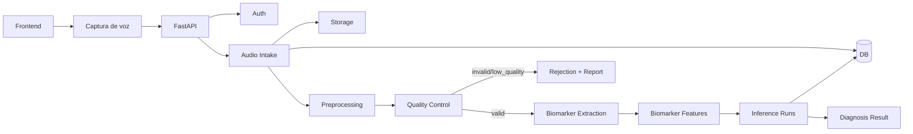

# Investigación Base para Extracción de Biomarcadores de Voz en Parkinson

## 1. Propósito del documento

Este documento resume los hallazgos técnicos del estado actual del proyecto MedDiag en la rama `mejoras-audio`, con el fin de servir como insumo para:

- investigación de librerías de análisis de voz,
- recopilación y evaluación de biomarcadores acústicos,
- diseño de pruebas experimentales,
- fortalecimiento del pipeline que alimenta los modelos predictivos actuales del proyecto.

El foco principal es la detección de biomarcadores de Parkinson a partir de voz sostenida y audio grabado por el usuario.

---

## 2. Estado actual del proyecto

El pipeline actual se apoya principalmente en [app/services/audio_processing.py](/home/aetaller/Documentos/proyectos/MedDiag2-mejoras-audio/app/services/audio_processing.py) y [app/services/audio_pipeline.py](/home/aetaller/Documentos/proyectos/MedDiag2-mejoras-audio/app/services/audio_pipeline.py).

### 2.1 Librerías ya presentes en la rama

Según [requirements.txt](/home/aetaller/Documentos/proyectos/MedDiag2-mejoras-audio/requirements.txt), las librerías relevantes para audio y biomarcadores son:

- `numpy`
- `scipy`
- `librosa`
- `praat-parselmouth`
- `soundfile`
- `pydub`

### 2.2 Papel actual de cada librería en el código

#### `librosa`

Actualmente es la librería más importante del pipeline real de extracción:

- carga audio con `librosa.load(...)`,
- calcula duración,
- estima frecuencia fundamental `F0` con `librosa.pyin(...)`.

En la implementación actual, `librosa` es el núcleo funcional para el análisis acústico base.

#### `pydub`

Se usa como mecanismo de respaldo para decodificar formatos cuando la carga con `librosa` falla.

Hoy su función es utilitaria:

- compatibilidad de formatos,
- decodificación,
- conversión básica.

No participa directamente en la extracción de biomarcadores clínicos.

#### `praat-parselmouth`

Está instalado y parcialmente contemplado en el código, pero hoy no es la base real de extracción. Su uso actual se limita a una ruta secundaria de estimación de pitch si falla la primera estrategia.

Sin embargo, por diseño y por evidencia bibliográfica, es la mejor librería disponible en esta rama para:

- jitter,
- shimmer,
- HNR,
- medidas de voz comparables con Praat.

#### `scipy`

Se usa como soporte matemático y como fallback de pitch por autocorrelación. También es útil para filtros, detección de picos y validaciones.

#### `soundfile`

Es una librería conveniente para lectura y escritura de audio PCM/WAV. Aunque no es protagonista en el código actual, puede aportar estabilidad en un pipeline de audio canónico.

#### `pandas`

No cumple un papel central en esta etapa de extracción de biomarcadores.

---

## 3. Biomarcadores que hoy intenta extraer el proyecto

El proyecto intenta alimentar el modelo de Parkinson con el conjunto:

- `MDVP:Fo(Hz)`
- `MDVP:Fhi(Hz)`
- `MDVP:Flo(Hz)`
- `MDVP:Jitter(%)`
- `MDVP:Jitter(Abs)`
- `MDVP:RAP`
- `MDVP:PPQ`
- `Jitter:DDP`
- `MDVP:Shimmer`
- `MDVP:Shimmer(dB)`
- `Shimmer:APQ3`
- `Shimmer:APQ5`
- `MDVP:APQ`
- `Shimmer:DDA`
- `NHR`
- `HNR`
- `RPDE`
- `DFA`
- `spread1`
- `spread2`
- `D2`
- `PPE`

Este conjunto coincide con el estilo de variables del dataset clásico de Parkinson utilizado ampliamente en investigación y en el propio proyecto.

---

## 4. Hallazgos técnicos principales

### 4.1 Lo que ya está razonablemente bien encaminado

- El proyecto ya tiene una arquitectura separada para:
  - carga/decodificación,
  - extracción de features,
  - validación,
  - pipeline de inferencia,
  - persistencia de resultados.
- La estrategia `librosa -> fallback` permite comenzar pruebas con múltiples formatos.
- La integración con el modelo predictivo ya está estructurada.

### 4.2 Lo que hoy es débil o debe revisarse antes de confiar clínicamente en las features

#### Jitter y shimmer

Las funciones actuales calculan jitter y shimmer mediante aproximaciones propias basadas en diferencias de `F0` y amplitud por ventanas.

Eso puede servir como experimento exploratorio, pero no como equivalente clínico sólido a las medidas tradicionales reportadas por Praat/MDVP.

#### HNR/NHR

La implementación actual usa una aproximación cepstral simple. Es útil como proxy, pero no ofrece la robustez esperada para biomarcadores clínicos comparables entre sesiones.

#### Variables no lineales

Las siguientes variables están actualmente generadas con placeholders aleatorios o aproximaciones no válidas:

- `RPDE`
- `DFA`
- `D2`
- `PPE`
- `spread1`
- `spread2`

Estas variables no deberían alimentar un modelo en producción mientras sigan siendo sintéticas o no reproducibles.

#### Imputación con `0.0`

Cuando una feature no puede calcularse, el sistema la rellena con `0.0`. Esto evita que el pipeline se detenga, pero introduce un riesgo fuerte:

- la predicción puede ser numéricamente válida,
- pero biomédicamente incorrecta o sesgada.

---

## 5. Comparación de librerías para el caso Parkinson

| Librería | Utilidad principal | Fortalezas | Limitaciones | Recomendación |
|---|---|---|---|---|
| `librosa` | Carga, preprocesamiento, pitch, espectro | Muy buena para DSP general, estable, flexible | No es la referencia clínica más fuerte para jitter/shimmer/HNR | Mantener como soporte base |
| `praat-parselmouth` | Acceso a algoritmos de Praat desde Python | Muy fuerte para biomarcadores vocales clínicos | Mayor sensibilidad a configuración y calidad de audio | Convertirla en núcleo del extractor clínico |
| `pydub` | Decodificación y compatibilidad de formatos | Muy útil como herramienta de entrada | No es librería de biomarcadores | Mantener solo como apoyo |
| `scipy` | DSP auxiliar, autocorrelación, filtros | Buen soporte científico y numérico | No reemplaza algoritmos clínicos de voz | Mantener como apoyo |
| `soundfile` | Lectura/escritura WAV/PCM | Conveniente para pipelines consistentes | No extrae biomarcadores | Recomendable para estandarización |

### Conclusión comparativa

La mejor combinación para esta rama es:

- `librosa` para carga, validación y preprocesamiento,
- `praat-parselmouth` para extracción biomarcadora clínica,
- `scipy` y `numpy` como apoyo matemático,
- `pydub` solo para compatibilidad de formatos.

---

## 6. Ruta técnica recomendada

### Fase 1. Estabilización del pipeline de entrada

Objetivo: asegurar que toda extracción parta de una señal comparable.

Recomendaciones:

- convertir a mono,
- fijar frecuencia de muestreo canónica, idealmente `16 kHz`,
- usar WAV PCM para el procesamiento interno,
- aplicar recorte de silencio inicial/final,
- normalizar nivel de manera conservadora,
- registrar duración efectiva y calidad de la señal.

### Fase 2. Migrar biomarcadores principales a `parselmouth`

Prioridad alta:

- `Fo`, `Fhi`, `Flo`
- `Jitter(%)`
- `Jitter(Abs)`
- `RAP`
- `PPQ`
- `DDP`
- `Shimmer`
- `Shimmer(dB)`
- `APQ3`
- `APQ5`
- `APQ`
- `DDA`
- `HNR`

La intención debe ser reemplazar las aproximaciones actuales por valores extraídos con algoritmos compatibles con Praat.

### Fase 3. Tratar con cuidado `NHR`

`NHR` puede:

- derivarse si existe una formulación clara compatible con el resto del pipeline,
- o mantenerse como feature separada solo si se documenta la equivalencia,
- o excluirse temporalmente del modelo si no se puede calcular de forma robusta.

### Fase 4. Pausar o rediseñar biomarcadores no lineales

Hasta no tener implementaciones reproducibles y bien documentadas, no conviene usar en inferencia:

- `RPDE`
- `DFA`
- `D2`
- `PPE`
- `spread1`
- `spread2`

Opciones realistas:

- implementar correctamente estos biomarcadores,
- entrenar un modelo reducido con features fiables,
- o marcar el pipeline como `partial_features` cuando solo existan biomarcadores clásicos.

### Fase 5. Validación experimental

Se recomienda montar una batería de pruebas con:

- vocal sostenida `/a/`,
- varios hablantes,
- múltiples repeticiones por persona,
- diferentes condiciones de grabación controladas,
- comparación de consistencia intra-sujeto.

Métricas a revisar:

- estabilidad entre corridas,
- sensibilidad al ruido,
- sensibilidad al recorte de silencio,
- consistencia entre formatos originales,
- rangos fisiológicos plausibles.

---

## 7. Ruta de investigación sugerida para MedDiag

### Ruta mínima viable

Si el objetivo es avanzar rápido y con bajo riesgo:

1. conservar `librosa` para entrada y preprocesamiento,
2. mover extracción de jitter, shimmer y HNR a `parselmouth`,
3. detener temporalmente las variables no lineales sintéticas,
4. correr predicción con un subconjunto robusto de features.

### Ruta intermedia

Si el objetivo es mejorar la validez científica del pipeline:

1. crear un extractor híbrido `librosa + parselmouth`,
2. registrar metadata de calidad del audio,
3. incorporar tests unitarios con audios de referencia,
4. comparar resultados entre sesiones y entre librerías.

### Ruta de investigación avanzada

Si el objetivo es aproximarse a investigación formal/publicable:

1. evaluar voz sostenida y habla conectada por separado,
2. comparar biomarcadores clásicos versus no lineales,
3. estudiar robustez frente a micrófonos y ruido,
4. correlacionar biomarcadores con severidad clínica,
5. valorar un rediseño del modelo predictivo con features realmente medidos y no imputados.

---

## 8. Recomendación final para el proyecto actual

Para el estado actual de MedDiag, la recomendación más clara es:

- **mantener `pydub` como utilidad de entrada**,
- **mantener `librosa` como soporte de carga y DSP general**,
- **usar `praat-parselmouth` como núcleo de biomarcadores clínicos**,
- **deshabilitar o aislar temporalmente las features no lineales no implementadas correctamente**.

Esto permitiría avanzar en evaluación de librerías y biomarcadores con una ruta técnicamente defendible y compatible con el modelo actual.

---

## 9. Riesgos metodológicos que deben documentarse en pruebas

- Las medidas de jitter y shimmer no son directamente intercambiables entre herramientas.
- Praat y MDVP no siempre producen valores idénticos, incluso cuando usan nombres similares.
- Los biomarcadores de voz son sensibles a:
  - ruido,
  - micrófono,
  - distancia al micrófono,
  - intensidad vocal,
  - frecuencia fundamental,
  - duración efectiva de la fonación,
  - segmentación de silencios.
- Un pipeline clínicamente útil requiere reproducibilidad, no solo capacidad de clasificar.

---

## 10. Bibliografía base recomendada

### Biomarcadores de voz en Parkinson

1. Little, M. A., McSharry, P. E., Hunter, E. J., Spielman, J., & Ramig, L. O. (2009). *Suitability of dysphonia measurements for telemonitoring of Parkinson's disease*. **IEEE Transactions on Biomedical Engineering**, 56(4), 1015-1022.  
   DOI: https://doi.org/10.1109/TBME.2008.2005954  
   PubMed: https://pubmed.ncbi.nlm.nih.gov/21399744/

2. Tsanas, A., Little, M. A., McSharry, P. E., Ramig, L. O. (2011). *Nonlinear speech analysis algorithms mapped to a standard metric achieve clinically useful quantification of average Parkinson's disease symptom severity*. **Journal of the Royal Society Interface**, 8(59), 842-855.  
   PubMed: https://pubmed.ncbi.nlm.nih.gov/21084338/

3. Voice-based detection of Parkinson’s disease using machine and deep learning approaches: systematic review.  
   PubMed: https://pubmed.ncbi.nlm.nih.gov/41301235/  
   Útil para contextualizar qué tipos de tareas vocales y features siguen siendo relevantes en literatura reciente.

### Praat / Parselmouth / biometría vocal

4. Jadoul, Y., Thompson, B., & de Boer, B. (2018). *Introducing Parselmouth: A Python interface to Praat*. **Journal of Phonetics**, 71, 1-15.  
   ScienceDirect: https://www.sciencedirect.com/science/article/pii/S0095447017301389

5. Boersma, P. (1993). *Accurate short-term analysis of the fundamental frequency and the harmonics-to-noise ratio of a sampled sound*. Proceedings of the Institute of Phonetic Sciences, 17, 97-110.  
   PDF: https://www.fon.hum.uva.nl/david/ba_shs/2010/Boersma_Proceedings_1993.pdf

6. Maryn, Y., Corthals, P., De Bodt, M., Van Cauwenberge, P., Deliyski, D. (2010). *Toward improved ecological validity in the acoustic measurement of overall voice quality: combining continuous speech and sustained vowels*. **Journal of Voice**, 24(5), 540-555.  
   Referencia útil para discutir validez ecológica de tareas vocales y limitaciones de usar solo vocal sostenida.

7. Deliyski, D. D., Shaw, H. S., & Evans, M. K. (2005). *Influence of sampling rate on accuracy and reliability of acoustic voice analysis*. **Logopedics Phoniatrics Vocology**, 30(2), 55-62.  
   Relevante para justificar estandarización de frecuencia de muestreo y cuidado en jitter/shimmer.

8. Deliyski, D. D., Evans, M. K., & Shaw, H. S. (2005/2006, línea metodológica citada ampliamente en Praat y Journal of Voice).  
   Relevante para advertir que medidas perturbacionales cambian según configuración y entorno.

### Librerías de análisis de audio en Python

9. McFee, B., Raffel, C., Liang, D., Ellis, D. P. W., McVicar, M., Battenberg, E., Nieto, O. (2015). *librosa: Audio and Music Signal Analysis in Python*. **Proceedings of the 14th Python in Science Conference (SciPy 2015)**.  
   Proceedings: https://proceedings.scipy.org/articles/proceedings-2015.pdf

### Referencias prácticas complementarias

10. Praat manual: *Voice 6. Automating voice analysis with a script*.  
    https://praat.org/manual/Voice_6__Automating_voice_analysis_with_a_script.html

11. Praat manual: *Voice 5. Comparison with other programs*.  
    https://praat.org/manual/Voice_5__Comparison_with_other_programs.html

Estas dos referencias no reemplazan papers revisados por pares, pero son muy importantes para entender:

- cómo Praat calcula jitter/shimmer/HNR,
- por qué no siempre coincide con MDVP,
- cómo automatizar extracción reproducible.

---

## 11. Conclusión ejecutiva

El proyecto ya tiene una base útil, pero todavía no posee un extractor clínicamente sólido para todos los biomarcadores que intenta usar.

La decisión técnica más razonable para continuar es:

- extraer biomarcadores clásicos con `parselmouth`,
- usar `librosa` para soporte y preprocesamiento,
- evitar que variables no lineales sintéticas entren al modelo,
- documentar experimentalmente reproducibilidad y calidad del audio.

Este documento debe servir como base de trabajo para la siguiente fase: **recopilación de pruebas, evaluación comparativa de librerías y diseño de un extractor de biomarcadores confiable para alimentar el modelo predictivo actual de MedDiag**.

---

## 12. Propuesta de arquitectura MedDiag2 (alineada con guía 2.0)

Esta sección actualiza la propuesta arquitectónica usando dos fuentes:

- el estado real del repositorio actual,
- la guía de arquitectura 2.0 del proyecto.

El objetivo es dejar trazable qué ya está implementado y qué falta para cumplir completamente la visión 2.0.

### 12.1 Lo que ya tiene implementado el proyecto

#### Frontend y captura

- captura de voz desde la interfaz web,
- envío de audio por `multipart/form-data`,
- flujo de consentimiento y visualización de biomarcadores.

#### API e intake de audio

- autenticación y autorización base,
- endpoint de carga `POST /audio/upload`,
- almacenamiento de archivo con UUID,
- persistencia de metadata inicial en `audio_records`.

#### Preprocesamiento y extracción

- decodificación robusta con `librosa` y fallback `pydub`,
- ruta de normalización a `mono + 16 kHz + WAV` en `voice_biomarkers`,
- extracción de biomarcadores con Parselmouth en endpoint dedicado (`/audio/biomarkers/extract`).

#### Inferencia y trazabilidad funcional

- pipeline de procesamiento e inferencia de Parkinson,
- validación de vector de features antes de predecir,
- bloqueo de inferencia cuando el vector es incompleto (`partial_features` en respuesta),
- almacenamiento de features y contexto del procesamiento en `notes` del audio.

### 12.2 Lo que falta para cumplir arquitectura 2.0 completa

#### Quality Control Service formal

No existe aún una capa explícita de control de calidad con:

- `clipping`,
- `noise level`,
- `RMS`,
- `silence ratio`,
- estabilidad de señal,
- clasificación formal `valid / invalid / low_quality`.

#### Modelo de datos 2.0 especializado

Actualmente el proyecto usa principalmente `audio_records` + `notes` JSON. Faltan tablas dedicadas:

- `audio_quality_reports`,
- `biomarker_features`,
- `inference_runs`,
- `ml_models` (o equivalente versionado de modelos).

#### Estados de audio alineados con 2.0

Falta incorporar en base de datos y flujo operativo estados como:

- `preprocessing`,
- `quality_checked`,
- `rejected`,
- `features_extracted`,
- `partial_features` (persistido como estado principal),
- `inference_completed`.

#### Endpoints recomendados de arquitectura

Faltan endpoints explícitos sugeridos por la guía:

- `GET /audio/{id}/quality`,
- `POST /audio/{id}/predict` (desacoplado de procesamiento),
- `GET /diagnoses/{id}`.

#### Núcleo clínico unificado

Aunque Parselmouth ya está integrado, el pipeline principal de inferencia todavía depende de un extractor híbrido con aproximaciones que no son totalmente equivalentes clínicas para todo el vector.

### 12.3 Arquitectura objetivo propuesta (incremental)

### 12.4 Plan de implementación propuesto

#### Fase A. Calidad de audio y estados

1. Crear `audio_quality_reports` y servicio de QC.
2. Añadir estados `preprocessing`, `quality_checked`, `rejected`.
3. Exponer `GET /audio/{id}/quality`.

#### Fase B. Feature store y versionado

1. Crear `biomarker_features` con:
   - `extractor_version`,
   - `feature_schema_version`,
   - `feature_status`.
2. Dejar de depender de `notes` como almacenamiento principal de features.

#### Fase C. Inferencia desacoplada y trazable

1. Crear `inference_runs` con versionado de modelo.
2. Implementar `POST /audio/{id}/predict`.
3. Implementar `GET /diagnoses/{id}`.

#### Fase D. Cierre clínico-técnico

1. Migrar biomarcadores perturbacionales principales a Parselmouth en pipeline principal.
2. Mantener bloqueo de inferencia para vectors incompletos o inválidos.
3. Consolidar criterios de aceptación de reproducibilidad por sesión.

### 12.5 Criterios de aceptación de arquitectura 2.0

Se considera cumplida la transición cuando:

- ningún audio pasa a inferencia sin reporte de calidad,
- ningún feature faltante se imputa silenciosamente con `0.0`,
- todo resultado de inferencia queda ligado a:
  - versión de extractor,
  - versión de esquema de features,
  - versión de modelo,
- el flujo API permite auditar por separado:
  - calidad,
  - features,
  - inferencia,
  - diagnóstico.
